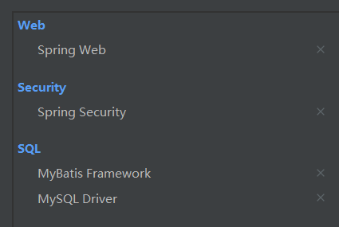
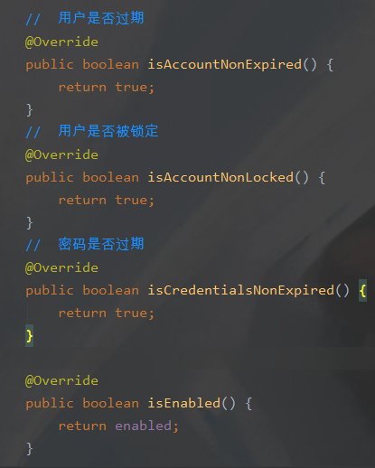
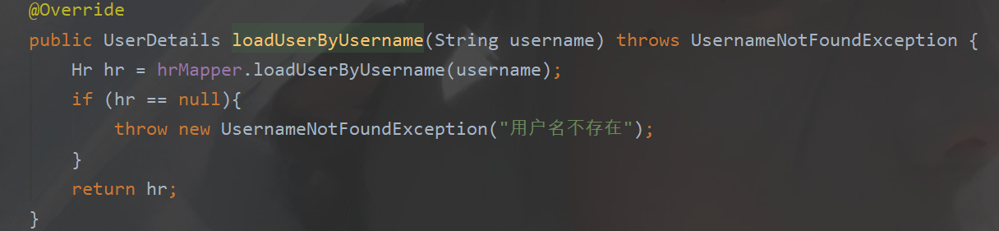
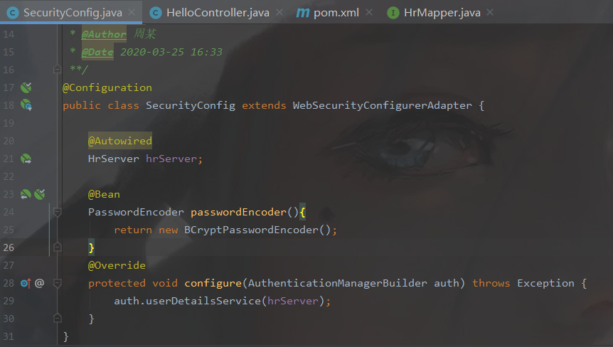
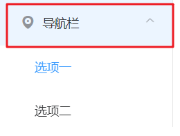
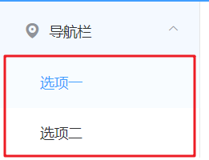
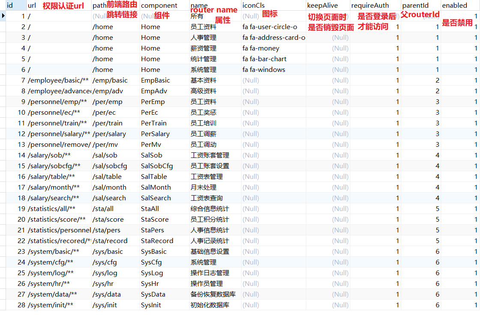
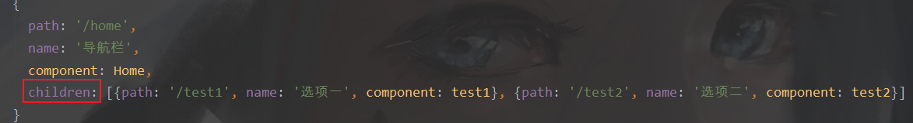
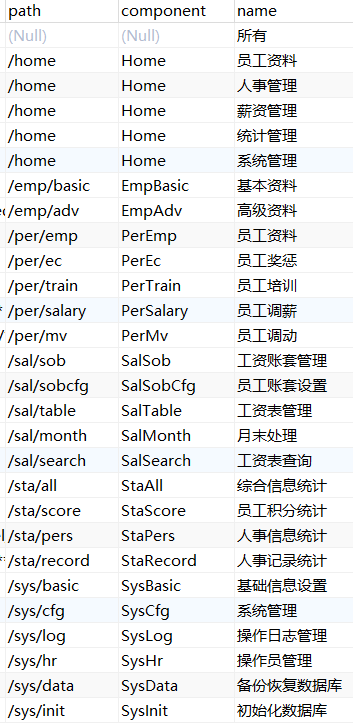
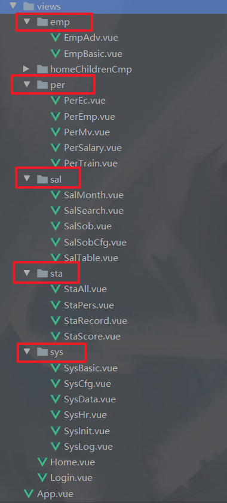

功能点：

1. SpringBoot （SSM）

2. Spring Security

3. Redis
4. POI / 邮件发送 / 消息中间件
5. MySQL
   6. Vue
7. axios
8. ElementUI 引入完整的element
9. Vuex

# 一、准备工作

## 1.1. 后端创建登录接口

后端初建项目依赖



开启权限：

用户类 implements UserDetail 重写其中一些方法



创建一个 HrServer implements UserDetailsService 并重写其中的方法，判断用户是否存在，并在 Mapper 层创建接口并查询数据库表



创建 SecurityConfig 继承 WebSecurityConfigurerAdapter 且添加注解 `@Configuration` ，并实现两个方法，一个用户密码加密，一个用于配置用户和权限，这里的用户来自于数据库 hrServer 中进行搜索



创建一个 helloController 然后进行测试，打开网页输入网址 localhost:8080/hello 发现跳转到登录页面，输入 admin 123（数据库中的测试用户）即可访问到 hello 页面

```java
@RestController
public class HelloController {
  @GetMapping("/hello")
  public String hello(){
    return "hello";
  }
}
```

创建一个响应类，当我们进行接口请求的时候都会使用这一类用来传递我们需要发送给前端的信息

```java
public class RespBean {
    private Integer status;
    private String msg;
    private Object obj;

    public static RespBean ok(String msg) {
        return new RespBean(200, msg, null);
    }
    public static RespBean ok(String msg, Object obj) {
        return new RespBean(200, msg, obj);
    }
    public static RespBean error(String msg) {
        return new RespBean(500, msg, null);
    }
    public static RespBean error(String msg, Object obj) {
        return new RespBean(500, msg, obj);
    }
   // 省略set/get、有无参构造方法、toString方法
}
```

接下来通过 `configure(HttpSecurity http)` 设置角色和权限的关系

```java
@Configuration
public class SecurityConfig extends WebSecurityConfigurerAdapter {

  @Autowired
  HrServer hrServer;

  @Bean
  PasswordEncoder passwordEncoder() {
    return new BCryptPasswordEncoder();
  }

  // 引入 server 配置用户
  @Override
  protected void configure(AuthenticationManagerBuilder auth) throws Exception {
    auth.userDetailsService(hrServer);
  }
  // 设置角色和权限的关系
  @Override
  protected void configure(HttpSecurity http) throws Exception {
    http.authorizeRequests()
      .anyRequest().authenticated()
      .and()
      .formLogin()
      .usernameParameter("username")
      .passwordParameter("password")
      .loginProcessingUrl("/doLogin")
      .loginPage("/login")
      // 登录成功后执行的方法
      .successHandler(new AuthenticationSuccessHandler() {
        @Override
        public void onAuthenticationSuccess(HttpServletRequest req, HttpServletResponse resp, Authentication authentication) throws IOException, ServletException {
          resp.setContentType("application/json;charset=utf-8");
          PrintWriter out = resp.getWriter();
          //  登录成功就获取用户信息并将其返回信息
          Hr hr = (Hr) authentication.getPrincipal();
          hr.setPassword(null);
          RespBean ok = RespBean.ok("登录成功！", hr);
          String s = new ObjectMapper().writeValueAsString(ok);
          out.write(s);
          out.flush();
          out.close();

        }
      })
      .failureHandler(new AuthenticationFailureHandler() {
        @Override
        public void onAuthenticationFailure(HttpServletRequest req, HttpServletResponse resp, AuthenticationException e) throws IOException, ServletException {
          resp.setContentType("application/json;charset=utf-8");
          PrintWriter out = resp.getWriter();
          RespBean respBean = RespBean.error("登录失败！");
          if (e instanceof LockedException) {
            respBean.setMsg("账号被锁定，请联系管理员！");
          } else if (e instanceof CredentialsExpiredException) {
            respBean.setMsg("密码过期，请联系管理员！");
          } else if (e instanceof AccountExpiredException) {
            respBean.setMsg("账户过期，请联系管理员！");
          } else if (e instanceof DisabledException) {
            respBean.setMsg("账户被禁用，请联系管理员！");
          } else if (e instanceof BadCredentialsException) {
            respBean.setMsg("用户名或密码输入错误，请重新输入！");
          }
          out.write(new ObjectMapper().writeValueAsString(respBean));
          out.flush();
          out.close();
        }
      })
      .permitAll()
      .and()
      .logout()
      .logoutSuccessHandler(new LogoutSuccessHandler() {
        @Override
        public void onLogoutSuccess(HttpServletRequest req, HttpServletResponse resp, Authentication authentication) throws IOException, ServletException {
          resp.setContentType("application/json;charset=utf-8");
          PrintWriter out = resp.getWriter();
          String s = new ObjectMapper().writeValueAsString(RespBean.ok("注销成功！"));
          out.write(s);
          out.flush();
          out.close();
        }
      })
      .permitAll()
      .and()
      .csrf().disable();
  }
}
```


## 1.2. 前端准备接收登录接口数据

整理所有请求信息，然后将其进行提示

* 后端自定义错误码以及错误信息，前端拦截失败信息

```js
// api.js
import axios from "axios"
import {Message} from "element-ui"

let base = '';

axios.interceptors.response.use(res => {
  // res.status：服务器自带的信息
  // res.data.status：后端自定义的信息
  // 这里含义为：如果请求响应成功但业务方面错误（如：请求成功但是账号密码不正确导致的业务错误）
  if (res.status && res.status == 200 && res.data.status == 500) {
    Message.error(res.data.msg);
    return;
  }
  // 返回正确信息
  return res.data
}, error => {
  if (error.response.status == 504 || error.response.status == 404) {
    Message.error("服务器被吃了")
  } else if (error.response.status == 403) {
    Message.error("权限不足，请联系管理员")
  }
  else if (error.response.status == 401) {
    Message.error("尚未登陆，请登录")
  } else {
    if (error.response.data.msg) {
      Message.error(error.response.data.msg)
    } else {
      Message.error("未知错误！")
    }
  }
  return;
})

// 定义登录请求
export const postKeyValueRequest = (url, params) => {
  return axios({
    method: 'post',
    url: `${base}${url}`,
    data: params,
    transformRequest: [function (data) {
      let ret = '';
      for (let i in data) {
        ret += encodeURIComponent(i) + "=" + encodeURIComponent(data[i]) + '&'
      }
      return ret;
    }],
    headers:{
      'Content-Type': 'application/x-www-form-urlencoded'
    }
  })
}
```

进行跨域

```js
// vue.config.js
let proxyObj = {};
proxyObj['/']={
  ws: false,
  target: 'http://localhost:8081',
  changeOrigin: true,
  pathRewrite:{
    '^/': ''
  }
}
module.exports={
  devServer:{
    host: 'localhost',
    port: 8080,
    proxy: proxyObj
  }
}
```

* 登录后将用户的信息存储到 sessionStorage 存储空间中

```vue
<template>
<div>
  <el-form :model="LoginForm" :rules="LoginRules" ref="LoginRef" label-width="100px" class="loginContainer">
    <h3 class="loginTitle">系统登录</h3>
    <el-form-item label="用户名称" prop="username">
      <el-input type="text" v-model="LoginForm.username" auto-complete="off" placeholder="请输入用户名"></el-input>
  </el-form-item>
    <el-form-item label="用户密码" prop="password">
      <el-input type="password" v-model="LoginForm.password" auto-complete="off" placeholder="请输入用户名"></el-input>
  </el-form-item>
    <el-checkbox v-model="checked" class="LoginRemember">记住我</el-checkbox>
    <el-button type="primary" style="width: 100%;" @click="submitClick">登录</el-button>
  </el-form>
  </div>
</template>

<script>

  export default {
    name: "Login",
    data() {
      return {
        LoginForm: {
          username: 'admin',
          password: '123'
        },
        checked: true,
        LoginRules: {
          username: [{required: true, message: '请输入用户名', trigger: true}],
          password: [{required: true, message: '请输入密码', trigger: true}]
        }
      }
    },
    methods: {
      submitClick() {
        this.$refs.LoginRef.validate((valid) => {
          if (valid) {
            this.postKeyValueRequest('/doLogin', this.LoginForm).then(res =>{
              if (res){
                // 将用户信息存储到sessionStorage存储空间中
                window.sessionStorage.setItem("user", JSON.stringify(res.obj))
                this.$router.replace("/home")
              }
            })
          } else {

            this.$message.error('用户名或密码不可为空')
            return false;
          }
        })
      }
    }
  }
</script>

<style scoped>
  .loginContainer {
    border-radius: 15px;
    background-clip: padding-box;
    margin: 180px auto;
    width: 350px;
    padding: 15px 35px 15px 35px;
    border: 1px solid #eaeaea;
    box-shadow: 0 0 25px #cac6c6;
  }

  .loginTitle {
    margin: 15px auto;
    text-align: center;
    color: #505458;
  }

  .LoginRemember {
    text-align: left;
    margin: 0 0 35px 0;
  }
</style>
```


## 1.3. 请求封装并使用插件功能

1、将请求进行封装

```js
// api.js
// ...
export const postRequest = (url, params) => {
  return axios({
    method: 'post',
    url: `${base}${url}`,
    data: params
  })
}
export const putRequest = (url, params) => {
  return axios({
    method: 'put',
    url: `${base}${url}`,
    data: params
  })
}
export const getRequest = (url, params) => {
  return axios({
    method: 'get',
    url: `${base}${url}`,
    data: params
  })
}
export const deleteRequest = (url, params) => {
  return axios({
    method: 'delete',
    url: `${base}${url}`,
    data: params
  })
}
```

2、使用插件功能，使用方法体的时候不需要 import 直接通过 this.

```js
// main.js
import {
  getRequest,
  postKeyValueRequest,
  deleteRequest,
  putRequest,
  postRequest
} from "./util/api";

Vue.prototype.postKeyValueRequest = postKeyValueRequest;
Vue.prototype.getRequest = getRequest;
Vue.prototype.deleteRequest = deleteRequest;
Vue.prototype.putRequest = putRequest;
Vue.prototype.postRequest = postRequest;
```

# 二、首页

## 2.1. title

1、从sessionStorage 中获取user信息

2、注销登录的时候将user信息清空

3、样式

```vue
<template>
<div>
  <el-container>
    <el-header class="homeHeader">
      <div class="title">微人事</div>
      <el-dropdown class="userInfo" @command="commandHandler">
        <span class="el-dropdown-link">
          {{user.name}}<i></i>
  </span>
        <el-dropdown-menu slot="dropdown">
          <el-dropdown-item command="userinfo">个人中心</el-dropdown-item>
          <el-dropdown-item command="setting">设置</el-dropdown-item>
          <el-dropdown-item command="logout" divided>注销登录</el-dropdown-item>
  </el-dropdown-menu>
  </el-dropdown>
  </el-header>
    <el-container>
      <el-aside width="200px"></el-aside>
      <el-main>Main</el-main>
  </el-container>
  </el-container>
  </div>
</template>

<script>
  export default {
    name: "Home",
    data() {
      return {
        // 获取用户信息
        user: JSON.parse(window.sessionStorage.getItem("user")),

      }
    },
    methods:{
      commandHandler(cmd){
        if (cmd == 'logout'){
          this.$confirm('此操作将注销登录, 是否继续?', '提示', {
            confirmButtonText: '确定',
            cancelButtonText: '取消',
            type: 'warning'
          }).then(() => {
            this.getRequest("/logout");
            // 清空sessionStorage的用户信息
            window.sessionStorage.removeItem("user")
            this.$router.replace("/")
          }).catch(() => {
            this.$message({
              type: 'info',
              message: '已取消操作'
            });
          });
        }
      }
    }
  }
</script>

<style scoped>
  .homeHeader {
    background-color: #409eff;
    display: flex;
    align-items: center;
    justify-content: space-between;
    padding: 0 15px;
    box-sizing: border-box;
  }

  .homeHeader .title {
    font-size: 30px;
    font-family: 华文行楷;
    color: #ffffff;
  }
  .homeHeader .userInfo{
    cursor: pointer;
  }
  .el-dropdown-link img{
    width: 48px;
    height: 48px;
    border-radius: 24px;
    margin-left: 8px;
  }
  .el-dropdown-link{
    display: flex;
    align-items: center;
  }
</style>
```

## 2.2. 左侧边栏

### 2.2.1. 前端数据化 - 初始

我们从router配置中进行前端侧边栏跳转配置，menu 通过获取router的配置属性来遍历 menu 内容，name：menu名；path：menu跳转url

1、使用 element-ui 中的 el-menu 组件

**2、动态的导入 router 中配置的跳转**

* 在router的 index.js 文件中配置

  * 导入组件 
  * 配置 Home 组件的子组件 ，注意配置路由的时候，name为子菜单名称，path为子菜单跳转路由
    * router-view 无法识别对象，在router配置的时候配置children属性，将子组件放入其中即可

  * 需要给不是 menu 的子组件添加属性 `hidden: true`，主要为了区分：引入 menu 时，隐藏for循环 `hidden: true` 的路由

  ```js
  const Login = () => import ('@/views/Login/Login')
  const Home = () => import ('@/views/Home/Home')
  const test1 = () => import ('@/views/Home/childrenCmp/test1')
  const test2 = () => import ('@/views/Home/childrenCmp/test2')
  
  const routes = [
    {path: '/', name: 'Login', component: Login, hidden: true},// hidden:隐藏标识，用于标记，当hidden不为true时...
    {path: '/home', name: 'Home', component: Home, hidden: true},
    {
      path: '/home',
      name: '导航栏',
      component: Home,
      children: [{path: '/test1', name: '选项一', component: test1}, {path: '/test2', name: '选项二', component: test2}]
    }
  ]
  ```

* 在首页中配置menu组件

  * 引入属性 router，这样就不需要写点击事件跳转页面的方法

    

  * `el-submenu` 为父导航栏，就是下图这个。我们 for循环router配置中 `hidden:false` 的路由组件。通过 `this.$router.options.routes` 获取路由配置对象

    

  * `el-menu-item` 为子导航栏，就是下图这个。在父导航栏下for循环其子路由。通过 `item.children` 来获取子路由配置对象

    

  ```vue
  <template>
    <div>
      <el-container>
        <el-header class="homeHeader">
          <!-- title，上节内容，这里省略以免影响思路 -->
        </el-header>
        <el-container>
          <el-aside width="200px">
            <!-- 新添加的内容 start -->
            <el-menu router>
              <!-- 父导航栏 -->
              <el-submenu index="1" v-for="(item,index) in this.$router.options.routes"
                          v-if="!item.hidden"
                          :key="index">
                <template slot="title">
                  <i class="el-icon-location"></i>
                  <span>{{item.name}}</span>
                </template>
  							<!-- 子导航栏 -->
                <el-menu-item :index="child.path" v-for="(child,indexj) in item.children" :key="indexj">{{child.name}}
                </el-menu-item>
              </el-submenu>
            </el-menu>
  				<!-- 新添加的内容 end -->
          </el-aside>
          <el-main>
            <router-view/>
          </el-main>
        </el-container>
      </el-container>
    </div>
  </template>
  
  <script>
  // ...
  </script>
  
  <style scoped>
  /* ... */
  </style>
  ```

### 2.2.2. 实现动态化 - 后端

如果我们想要动态的配置 URL，该怎么操作？

* 数据库：在数据库中添加 menu 表，下面是内容



* JSON 格式 需要调整为下面的格式

```json
{
  path: '/home',
  name: '导航栏',
  component: Home,
  children: [{
    path: '/test1', 
    name: '选项一', 
    component: test1
  }, {
    path: '/test2',
    name: '选项二', 
    component: test2
  }]
}
```

#### 2.2.2.1. 前提工作

修改 Menu 类，将 Menu 类中两个参数删除并添加个新类专门存放这两个参数

* 在前端配置中，配置路由并不需要使用这两个参数，但在后端需要用于识别，前端可以将其配置到 meta 属性中
* 创建新类 Meta，将这两个参数放入

```java
public class Meta {
  private Boolean keepAlive;
  private Boolean requireAuth;
  // 省略set/get
}
```

修改 Menu 类，添加两个属性：一个引入 Meta 类，另一个为 Children 属性列表

* Meta 属性将用于配置路由的 meta属性
* children 属性列表用于存放路由的子路由



```java
public class Menu {
  // 存放多余的两个参数,届时直接携带到 router 配置中
  private Meta meta;
  // 路由的 children 值
  private List<Menu> children;
  
  // 省略剩余的属性以及他们的set/get  
}
```

因为上面 Menu 类进行了修改，所以需要修改 MenuMapper.xml 的内容

* 删除多余的那两个属性
* 引入一对多的对象 Meta

#### 2.2.2.2. 编写Server、Mapper、Controller代码

1、Controller层代码

```java
// 系统配置Controller
@RestController
@RequestMapping("/system/config")
public class SystemConfigController {
    @Autowired
    MenuServer menuServer;

    // 前端数据不可行，所以数据方面
    @GetMapping("/menu")
    public List<Menu> getMenusByHrId() {
        return menuServer.getMenusByHrId();
    }
}
```

2、Server层代码

* **如果后端存在参数尽量不要使用前端传递过来的参数，因为不可信**
* **因为后端可以通过 `SecurityContextHolder.getContext().getAuthentication().getPrincipal()` 来获取用户登录的角色ID，所以从后端直接引用即可，不通过前端获取角色ID**

```java
// MenuServer.java
@Service
public class MenuServer {
    @Autowired
    MenuMapper menuMapper;

    public List<Menu> getMenusByHrId(){
        // SecurityContextHolder.getContext().getAuthentication().getPrincipal() 当前用户登录的对象
        return menuMapper.getMenusByHrId(((Hr)SecurityContextHolder.getContext().getAuthentication().getPrincipal()).getId());
    }

}
```

3、Mapper层代码

* SQL应先进行测试才放到 Mapper 中，所以现在 navicat 中测试 SQL 代码

  ```sql
  select DISTINCT m1.*,m2.`id` as id2, m2.`component` as component2,m2.`iconCls` as iconCls2,m2.`keepAlive` as keepAlive2,m2.`name` as name2,m2.`parentId` as parentId2,m2.`requireAuth` as requireAuth2,m2.`path` as path2 from menu m1,menu m2,hr_role hrr,menu_role mr where m1.`id`=m2.`parentId` and hrr.`hrid` =10 and hrr.`rid`=mr.`rid` and mr.`mid` = m2.`id` and m2.`enabled` = true order by m1.`id`,m2.`id`
  ```

* 测试完成后再放入代码中

  ```xml
  <select id="getMenusByHrId">
    select DISTINCT m1.*,m2.`id` as id2, m2.`component` as component2,m2.`iconCls` as iconCls2,m2.`keepAlive` as keepAlive2,m2.`name` as name2,m2.`parentId` as parentId2,m2.`requireAuth` as requireAuth2,m2.`path` as path2 from menu m1,menu m2,hr_role hrr,menu_role mr where m1.`id`=m2.`parentId` and hrr.`hrid` =#{hrId} and hrr.`rid`=mr.`rid` and mr.`mid` = m2.`id` and m2.`enabled` = true order by m1.`id`,m2.`id`
  </select>
  ```

* 鉴于我们需要返回的JSON是下面的形式

  ```json
  {
    path: '/home',
    name: '导航栏',
    component: Home,
    children: [{
      path: '/test1', 
      name: '选项一', 
      component: test1
    }, {
      path: '/test2',
      name: '选项二', 
      component: test2
    }]
  }
  ```

* 为了适应性，所以配置多一个映射，然后让此映射继承基本映射来映射出 children 属性

  ```xml
  <!-- MenuMapper.xml -->
  <!-- Menu类基本映射 -->
  <resultMap id="BaseResultMap" type="org.javaboy.vhr.model.Menu">
    <id column="id" property="id" jdbcType="INTEGER"/>
    <result column="url" property="url" jdbcType="VARCHAR"/>
    <result column="path" property="path" jdbcType="VARCHAR"/>
    <result column="component" property="component" jdbcType="VARCHAR"/>
    <result column="name" property="name" jdbcType="VARCHAR"/>
    <result column="iconCls" property="iconCls" jdbcType="VARCHAR"/>
    <result column="parentId" property="parentId" jdbcType="INTEGER"/>
    <result column="enabled" property="enabled" jdbcType="BIT"/>
    <!-- 使用association引入对象Meta -->
    <association property="meta" javaType="org.javaboy.vhr.model.Meta">
      <result column="keepAlive" property="keepAlive" jdbcType="BIT"/>
      <result column="requireAuth" property="requireAuth" jdbcType="BIT"/>
    </association>
  </resultMap>
  <!-- 再创建一个resultMap，继承 Menu类 基本映射且通过collection来进行一对多映射  -->
  <resultMap id="Menus2" type="org.javaboy.vhr.model.Menu" extends="BaseResultMap">
    <collection property="children" ofType="org.javaboy.vhr.model.Menu">
      <id column="id2" property="id" jdbcType="INTEGER"/>
      <result column="url2" property="url" jdbcType="VARCHAR"/>
      <result column="path2" property="path" jdbcType="VARCHAR"/>
      <result column="component2" property="component" jdbcType="VARCHAR"/>
      <result column="name2" property="name" jdbcType="VARCHAR"/>
      <result column="iconCls2" property="iconCls" jdbcType="VARCHAR"/>
      <result column="parentId2" property="parentId" jdbcType="INTEGER"/>
      <result column="enabled2" property="enabled" jdbcType="BIT"/>
      <association property="meta" javaType="org.javaboy.vhr.model.Meta">
        <result column="keepAlive2" property="keepAlive" jdbcType="BIT"/>
        <result column="requireAuth2" property="requireAuth" jdbcType="BIT"/>
      </association>
    </collection>
  </resultMap>
  <!-- 返回类型定义为我们新定义的映射 -->
  <select id="getMenusByHrId" resultMap="Menus2">
    select DISTINCT m1.*,m2.`id` as id2, m2.`component` as component2,m2.`iconCls` as iconCls2,m2.`keepAlive` as keepAlive2,m2.`name` as name2,m2.`parentId` as parentId2,m2.`requireAuth` as requireAuth2,m2.`path` as path2 from menu m1,menu m2,hr_role hrr,menu_role mr where m1.`id`=m2.`parentId` and hrr.`hrid` =#{hrId} and hrr.`rid`=mr.`rid` and mr.`mid` = m2.`id` and m2.`enabled` = true order by m1.`id`,m2.`id`
  </select>
  ```

测试后返回 JSON

```Json
[
  {
    "id": 2,
    "url": "/",
    "path": "/home",
    "component": "Home",
    "name": "员工资料",
    "iconCls": "fa fa-user-circle-o",
    "meta": {
      "keepAlive": null,
      "requireAuth": true
    },
    "children": [
      {
        "id": 7,
        "url": null,
        "path": "/emp/basic",
        "component": "EmpBasic",
        "name": "基本资料",
        "iconCls": null,
        "meta": {
          "keepAlive": null,
          "requireAuth": true
        },
        "children": null,
        "parentId": 2,
        "enabled": null
      },
      {
        "id": 8,
        "url": null,
        "path": "/emp/adv",
        "component": "EmpAdv",
        "name": "高级资料",
        "iconCls": null,
        "meta": {
          "keepAlive": null,
          "requireAuth": true
        },
        "children": null,
        "parentId": 2,
        "enabled": null
      }
    ],
    "parentId": 1,
    "enabled": true
  },
  {
    "id": 3,
    "url": "/",
    "path": "/home",
    "component": "Home",
    "name": "人事管理",
    "iconCls": "fa fa-address-card-o",
    "meta": {
      "keepAlive": null,
      "requireAuth": true
    },
    "children": [
      {
        "id": 11,
        "url": null,
        "path": "/per/train",
        "component": "PerTrain",
        "name": "员工培训",
        "iconCls": null,
        "meta": {
          "keepAlive": null,
          "requireAuth": true
        },
        "children": null,
        "parentId": 3,
        "enabled": null
      }
    ],
    "parentId": 1,
    "enabled": true
  }
]
```

### 2.2.3. 实现动态化 - 前端

#### 2.2.3.1. 使用 VueX 存放菜单数据

菜单项数据加载成功之后，如果想要所有组件都能够访问此数据我们可以选下面几个地方存放：

1. sessionStorage
2. localStorage
3. VueX

但为了提高安全性，我们选择 VueX

---

接下来下载 VueX 以及配置 VueX

```shell
npm install vuex
```

创建 store 文件夹以及index.js 文件

```js
import Vue from 'vue'
import Vuex from 'vuex'

Vue.use(Vuex)

export default new Vuex.Store({
    state: {
        routes: []
    },
    mutations: {
        initRoutes(state, data) {
            state.routes = data;
        }
    },
    actions: {}
})
```

引入 main.js 的 Vue 实例对象

```js
// ...省略其余配置
import store from "./store";
new Vue({
  router,
  store,
  render: h => h(App)
}).$mount('#app')
```

#### 2.2.3.2. 创建工具类修改菜单数据格式

因为返回的JSON格式有部分数据无法直接引用。eg：component 引用的是路径对象而不是字符串；部分无用参数

创建工具JS `menus.js` 

```js
//  menus.js
import {getRequest} from "./api";

export const initMenu = (router, store)=>{
  if (store.state.routes.length > 0){
    return;
  }
  getRequest("/system/config/menu").then(data=>{
    if (data){
      // 格式化返回数据
      let fmtRoutes = formatRoutes(data);
      // 将格式化后的数据存放到路由配置中
      router.addRoutes(fmtRoutes)
      // 将数据存放到VueX中
      store.commit('initRoutes', fmtRoutes)
    }
  })
}

export const formatRoutes =(routes)=>{
  let fmRoutes =[];
  routes.forEach(router=>{
    let {path,component,name,meta,iconCls,children} = router;
    // 如果children存在且是数组……（防止children为空且为null）
    if (children && children instanceof Array){
      // 重新遍历一遍防止子组件children出现为空的情况
      children = formatRoutes(children)
    }
    let fmRouter ={
      path,
      name,
      iconCls,
      meta,
      children,
      component: () => import('@/views/'+component+'.vue')
    };
    fmRoutes.push(fmRouter);
  })
  return fmRoutes;
}
```

#### 2.2.3.3. 导入组件和修改工具类

我们需要将数据库中所有需要用到的组件都创建出来，并且为了防止存放在同个 views 文件夹中导致 vue 文件过多，按数据库中组件前缀来创建对应的文件夹来存放组件。

数据库的数据如下：



创建后的目录文件如下：



接下来修改工具类

```js
// menus.js
import {getRequest} from "./api";

export const initMenu = (router, store) => {
  if (store.state.routes.length > 0) {
    return;
  }
  getRequest("/system/config/menu").then(data => {
    if (data) {
      // 格式化返 回数据
      let fmtRoutes = formatRoutes(data);
      // 将格式化后的数据存放到路由配置中
      router.addRoutes(fmtRoutes);
      // 将数据存放到VueX中
      store.commit('initRoutes', fmtRoutes)
    }
  })
}

export const formatRoutes = (routes) => {
  let fmRoutes = [];
  routes.forEach(router => {
    let {path, component, name, meta, iconCls, children} = router;
    // 如果children存在且是数组……（防止children为空且为null）
    if (children && children instanceof Array) {
      // 重新遍历一遍防止子组件children出现为空的情况
      children = formatRoutes(children)
    }
    let fmRouter = {
      path,
      name,
      iconCls,
      meta,
      children,
      // 修改导入组件的形式  === start ===
      component(resolve) {
        if (component.startsWith("Home")) {
          require(['@/views/' + component + '.vue'], resolve)
        } else if (component.startsWith("Emp")) {
          require(['@/views/emp/' + component + '.vue'], resolve)
        }  else if (component.startsWith("Per")) {
          require(['@/views/per/' + component + '.vue'], resolve)
        } else if (component.startsWith("Sal")) {
          require(['@/views/sal/' + component + '.vue'], resolve)
        } else if (component.startsWith("Sta")) {
          require(['@/views/sta/' + component + '.vue'], resolve)
        } else if (component.startsWith("Sys")) {
          require(['@/views/sys/' + component + '.vue'], resolve)
        }
      }
      // === end ===
    };
    fmRoutes.push(fmRouter);
  })
  return fmRoutes;
}
```

#### 2.2.3.4. 左边导航菜单加载

利用路由导航守卫 - 全局前置守卫来加载菜单数据

调用 router 来进行全局前置守卫的配置

```js
// main.js
// ....
import {initMenu} from "./util/menus";
import router from './router'
import store from "./store";
// 配置全局导航守卫
router.beforeEach((to, from, next) => {
  if(to.path == '/'){
    next();
  }else {
    initMenu(router, store);
    next();
  }
})
// ...
```

在 Home.vue 中引入 VueX 的state数据，然后赋值给routers循环对象

```vue
<template>
  <div>
    <el-container>
      <el-header class="homeHeader">
        <div class="title">微人事</div>
        <el-dropdown class="userInfo" @command="commandHandler">
          <span class="el-dropdown-link">
            {{user.name}}<i></i>
          </span>
          <el-dropdown-menu slot="dropdown">
            <el-dropdown-item command="userinfo">个人中心</el-dropdown-item>
            <el-dropdown-item command="setting">设置</el-dropdown-item>
            <el-dropdown-item command="logout" divided>注销登录</el-dropdown-item>
          </el-dropdown-menu>
        </el-dropdown>
      </el-header>
      <el-container>
        <el-aside width="200px">
          <el-menu router unique-opened>
            <el-submenu :index="index+''" v-for="(item,index) in routes"
                        v-if="!item.hidden"
                        :key="index">
              <template slot="title">
                <i class="el-icon-location"></i>
                <span>{{item.name}}</span>
              </template>
              <el-menu-item :index="child.path" v-for="(child,indexj) in item.children" :key="indexj">{{child.name}}
              </el-menu-item>
            </el-submenu>
          </el-menu>
        </el-aside>
        <el-main>
          <router-view/>
        </el-main>
      </el-container>
    </el-container>
  </div>
</template>

<script>
  export default {
    name: "Home",
    data() {
      return {
        user: JSON.parse(window.sessionStorage.getItem("user")),

      }
    },
    methods: {
      commandHandler(cmd) {
        if (cmd == 'logout') {
          this.$confirm('此操作将注销登录, 是否继续?', '提示', {
            confirmButtonText: '确定',
            cancelButtonText: '取消',
            type: 'warning'
          }).then(() => {
            this.getRequest("/logout");
            // 清空sessionStorage的用户信息
            window.sessionStorage.removeItem("user")
            this.$router.replace("/")
          }).catch(() => {
            this.$message({
              type: 'info',
              message: '已取消操作'
            });
          });
        }
      }
    },
    computed:{
      // 添加
      routes(){
        return this.$store.state.routes;
      }
    }
  }
</script>

<style scoped>
 /*...*/
</style>
```

 出现一个问题：当登录另一个角色时，菜单项没有做相对应的修改，刷新之后才修改

原因：在请求菜单项数据的时候只是判断 VueX 中不存在数据时重新请求数据。

怎么解决：在 Home.vue 组件中退出登录操作里删除菜单项数据

```vue
<script>
  //...
  methods: {
    commandHandler(cmd) {
      if (cmd == 'logout') {
        this.$confirm('此操作将注销登录, 是否继续?', '提示', {
          confirmButtonText: '确定',
          cancelButtonText: '取消',
          type: 'warning'
        }).then(() => {
          this.getRequest("/logout");
          // 清空sessionStorage的用户信息
          window.sessionStorage.removeItem("user")
          this.$router.replace("/")
          // 清空Vuex中的菜单数据
          this.$store.commit('initRoutes', [])
        }).catch(() => {
          this.$message({
            type: 'info',
            message: '已取消操作'
          });
        });
      }
    }
  }
  //...
</script>
```

菜单项的图标的显示

* 数据库中存储的 icon 是 font-awesome，所以要先下载 font-awesome

  ```shell
  npm install font-awesome
  ```

* 引用 font-awesome

  ```js
  // main.js
  import 'font-awesome/css/font-awesome.min.css'
  ```

* 修改 Home.vue 中的菜单显示图标并修改样式

  ```vue
   <i style="color: #409eff;margin-right: 6px" :class="item.iconCls"></i>
  ```

补充：点击回车直接提交信息 Login.vue ，在 input 标签里添加下面的属性

```html
@keydown.enter.native="submitClick"
```


浅谈权限问题

隐藏内容不代表控制了权限，而是为了提高用户体验

权限控制由后端完成，每一个接口都需要有对应的角色才能访问，否则不能访问

如果用户想要访问未授权的页面，不要直接跳转到空白页，可以使用前置路由导航拦截请求重定向到登录页或者停滞在当页并给予未授权提示即可


