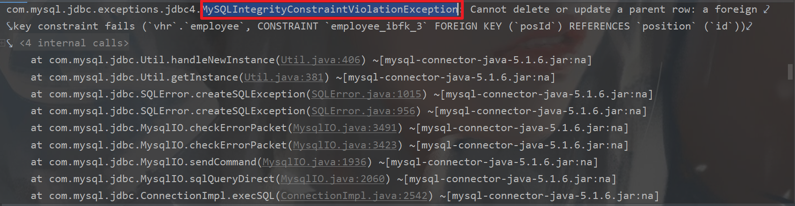

# 一、基础信息设置页

## 1.1. 初始化

使用 el-tabs 绘画出标签页（选项卡样式）并且给每个选项创建一个组件

```vue
<template>
	<div>
    <el-tabs v-model="activeName" type="card" >
       <el-tab-pane label="部门管理" name="first">
          <dep-mana/>
      </el-tab-pane>
        <el-tab-pane label="职位管理" name="second">
          <pos-mana/>
      </el-tab-pane>
        <el-tab-pane label="职称管理" name="third">
          <job-level-mana/>
      </el-tab-pane>
        <el-tab-pane label="奖惩规则" name="fourth">
          <ec-mana/>
      </el-tab-pane>
        <el-tab-pane label="权限组" name="five">
          <permiss-mana/>
      </el-tab-pane>
    </el-tabs>
  </div>
</template>
 
<script>
  import DepMana from "@/components/sys/basic/DepMana";
  import PosMana from "@/components/sys/basic/PosMana";
  import JobLevelMana from "@//components/sys/basic/JobLevelMana";
  import EcMana from "@/components/sys/basic/EcMana";
  import PermissMana from "@/components/sys/basic/PermissMana";
  export default {
    name: "SysBasic",
    components: {PermissMana, EcMana, JobLevelMana, PosMana, DepMana},
    data(){
      return{
        activeName: 'first'
      }
    }
  }
</script>
```

## 1.2. 职位管理开发

### 1.2.1. 前端组件开发

这里是初步开发组件，主要是为了一个展示效果

注意：表单数据内容需要和后端的类属性对应

```vue
<template>
<div>
  <div>
    <!-- 表单输入框 -->
    <el-input
              size="small"
              class="addPosInput"
              placeholder="添加职位..."
              prefix-icon="el-icon-plus"
              v-model="pos.name">
  </el-input>
    <el-button icon="el-icon-plus" size="small" type="primary">添加</el-button>
  </div>
  <div class="posManaMain">
    <!-- 展示职位的表格 -->
    <el-table
              :data="positions"
              stripe
              size="small"
              border
              style="width: 70%">
      <el-table-column
                       prop="id"
                       label="编号"
                       width="50">
  </el-table-column>
      <el-table-column
                       prop="name"
                       label="职位名称"
                       width="120">
  </el-table-column>
      <el-table-column
                       prop="createDate"
                       label="创建时间">
  </el-table-column>
  </el-table>
  </div>
  </div>
</template>

<script>
  export default {
    name: "PosMana",
    data() {
      return {
        pos: {
          name: '',
        },
        positions: []
      }
    }
  }
</script>

<style scoped>
  .addPosInput {
    width: 300px;
    margin-right: 5px;
  }
  .posManaMain{
    margin-top: 5px;
  }
</style>
```

### 1.2.2. 后端接口开发

规范：需遵循Result风格

接口需求：

* 增、 删、改、查

Controller层

```java
// 注意因为我们的权限url是从数据库获取的，所以url必须要适配数据库中的url
@RestController
@RequestMapping("/system/basic/pos")
public class PositionController {

  @Autowired
  PositionService positionService;

  /* 查 */
  @GetMapping("/")
  public List<Position> getAllPositions() {
    return positionService.getAllPositions();
  }

  /* 增 */
  @PostMapping("/")
  public RespBean addPosition(@RequestBody Position position) {
    if (positionService.addPosition(position) == 1) {
      return RespBean.ok("添加成功！");
    }
    return RespBean.error("添加失败！");
  }

  /* 改 */
  @PutMapping("/")
  public RespBean updatePositions(@RequestBody Position position) {
    if (positionService.updatePositions(position) == 1) {
      return RespBean.ok("更新成功！");
    }
    return RespBean.error("更新失败！");
  }

  /* 删 */
  @DeleteMapping("/{id}")
  public RespBean deletePositionById(@PathVariable Integer id) {
    if (positionService.deletePositionById(id) == 1) {
      return RespBean.ok("删除成功！");
    }
    return RespBean.error("删除失败！");
  }
}
```

Service层

* 这里除了第一个查找的sql语句是自己写的其余的都是使用第三方Mybatis-Plus自动生成的sql方法

```java
@Service
public class PositionService {

  @Autowired
  PositionMapper positionMapper;

  public List<Position> getAllPositions() {
    return positionMapper.getAllPositions();
  }

  public Integer addPosition(Position position) {
    position.setEnabled(true);
    position.setCreateDate(new Date());
    return positionMapper.insertSelective(position);
  }

  public Integer updatePositions(Position position) {
    return positionMapper.updateByPrimaryKeySelective(position);
  }

  public int deletePositionById(Integer id) {
    return positionMapper.deleteByPrimaryKey(id);
  }
}
```

Mapper层

```xml
<select id="getAllPositions" resultMap="BaseResultMap">
  select * from position
</select>
```

### 1.2.3. 接口对接

注意：

* 在点击编辑出现弹窗进行操作的时候出现问题如下

```js
// 出现问题: 当直接将data赋值给updatePos时，updatePos 和 pos 的数据会捆绑在一起,input输入的时候表格中的数据会随着发生变化
// 解决方法: 使用 Object.assign(目标，源数据) 将pos数据复制到updatePos即可，这样在就不会造成数据捆绑的现象
```

添加部分组件：

* 两行 `el-table-column` 一个用于是否全选；一个用于操作行（编辑、删除）
* 一个 `el-dialog` 弹出窗，点击编辑弹出此窗口

```html
<div>
  <el-table
            :data="positions"
            stripe
            size="small"
            border
            style="width: 70%">
    <el-table-column
                     type="selection"
                     width="55">
    </el-table-column>
    <el-table-column
                     prop="id"
                     label="编号"
                     width="50">
    </el-table-column>
    <el-table-column
                     prop="name"
                     label="职位名称"
                     width="180">
    </el-table-column>
    <el-table-column
                     prop="createDate"
                     width="150px"
                     label="创建时间">
    </el-table-column>
    <el-table-column label="操作">
      <template slot-scope="scope">
        <el-button
                   size="mini"
                   @click="showEditDialog(scope.$index, scope.row)">编辑
        </el-button>
        <el-button
                   size="mini"
                   type="danger"
                   @click="handleDelete(scope.$index, scope.row)">删除
        </el-button>
      </template>
    </el-table-column>
  </el-table>
</div>
<!-- 编辑按钮弹窗 -->
<el-dialog
           title="修改职位"
           :visible.sync="dialogVisible"
           width="30%">
  <div>
    <el-tag>职位名称</el-tag>
    <el-input class="updatePosInput" size="small" v-model="updatePos.name" @keydown.enter.native="doUpdate"></el-input>
  </div>
  <span slot="footer" class="dialog-footer">
    <el-button size="small" @click="dialogVisible = false">取 消</el-button>
    <el-button size="small" type="primary"  @click="doUpdate">确 定</el-button>
  </span>
</el-dialog>
```

调用方法以及完善内容

```vue
<template>
<div>
  <div>
    <el-input
              size="small"
              class="addPosInput"
              placeholder="添加职位..."
              prefix-icon="el-icon-plus"
              @keydown.enter.native="addPosition"
              v-model="pos.name">
  </el-input>
    <el-button icon="el-icon-plus" size="small" type="primary" @click="addPosition">添加</el-button>
  </div>
  <div class="posManaMain">
    <el-table
              :data="positions"
              stripe
              size="small"
              border
              style="width: 70%">
      <el-table-column
                       type="selection"
                       width="55">
  </el-table-column>
      <el-table-column
                       prop="id"
                       label="编号"
                       width="50">
  </el-table-column>
      <el-table-column
                       prop="name"
                       label="职位名称"
                       width="180">
  </el-table-column>
      <el-table-column
                       prop="createDate"
                       width="150px"
                       label="创建时间">
  </el-table-column>
      <el-table-column label="操作">
        <template slot-scope="scope">
          <el-button
                     size="mini"
                     @click="showEditDialog(scope.$index, scope.row)">编辑
  </el-button>
          <el-button
                     size="mini"
                     type="danger"
                     @click="handleDelete(scope.$index, scope.row)">删除
  </el-button>
</template>
</el-table-column>
</el-table>
</div>
<el-dialog
           title="修改职位"
           :visible.sync="dialogVisible"
           width="30%">
  <div>
    <el-tag>职位名称</el-tag>
    <el-input class="updatePosInput" size="small" v-model="updatePos.name" @keydown.enter.native="doUpdate"></el-input>
  </div>
  <span slot="footer" class="dialog-footer">
    <el-button size="small" @click="dialogVisible = false">取 消</el-button>
    <el-button size="small" type="primary"  @click="doUpdate">确 定</el-button>
  </span>
</el-dialog>
</div>
</template>

<script>
  export default {
    name: "PosMana",
    data() {
      return {
        pos: {
          name: '',
        },
        updatePos: {
          name: '',
        },
        positions: [],
        dialogVisible: false
      }
    },
    mounted() {
      this.initPositions();
    },
    methods: {
      initPositions() {
        this.getRequest("/system/basic/pos/").then(res => {
          if (res) {
            this.positions = res;
          }
        })
      },
      showEditDialog(index, data) {
        // 出现问题: 当直接将data赋值给updatePos时，updatePos 和 pos 的数据会捆绑在一起,input输入的时候表格中的数据会随着发生变化
        // 解决方法: 使用 Object.assign(目标，源数据) 将pos数据复制到updatePos即可
        Object.assign(this.updatePos,data)
        this.dialogVisible = true
      },
      doUpdate() {
        if (this.updatePos.name) {
          this.putRequest("/system/basic/pos/", this.updatePos).then(res => {
            if (res) {
              this.initPositions()
              this.updatePos.name = ''
              this.dialogVisible = false
            }
          })
        }else{
          this.$message.error("职位名称不可为空!")
        }
      },
      handleDelete(index, data) {
        this.$confirm('此操作将永久删除【' + data.name + '】职位, 是否继续?', '提示', {
          confirmButtonText: '确定',
          cancelButtonText: '取消',
          type: 'warning'
        }).then(() => {
          this.deleteRequest("/system/basic/pos/" + data.id).then(res => {
            this.initPositions();
          })
        }).catch(() => {
          this.$message({
            type: 'info',
            message: '已取消删除'
          });
        });
      },
      addPosition() {
        if (this.pos.name) {
          this.postRequest("/system/basic/pos/", this.pos).then(res => {
            if (res) {
              this.initPositions();
              this.pos.name = ''
            }
          })
        } else {
          this.$message.error("职位名称不可为空！")
        }
      }
    }
  }
</script>

<style scoped>
  .addPosInput {
    width: 300px;
    margin-right: 5px;
  }

  .updatePosInput {
    width: 200px;
    margin-left: 8px;
  }

  .posManaMain {
    margin-top: 5px;
  }
</style>
```

### 1.2.4. 全局异常统一处理、格式化日期

说明：在删除职位表格的时候出现报错

原因：数据库中职位存在外键，无法删除，但是前端获取不到删除失败原因，只能返回删除失败

人性化操作：出现错误原因，修改其返回的信息

首先获取错误原因（MySQLIntegrityConstraintViolationException）



```java
@RestControllerAdvice
public class GlobalExceptionHandler {
  @ExceptionHandler(SQLException.class)
  public RespBean sqlException(SQLException e) {
    if (e instanceof MySQLIntegrityConstraintViolationException) {
      return RespBean.error("改数据存在关联数据，操作失败！");
    }
    return RespBean.error("数据库异常，操作失败！");
  }
}
```

---

前端获取的时间格式比较复杂，我们可以前端进行格式化也可以后端进行格式化，前端格式化比较繁琐，所以我们这里采用后端格式化时间：

* 使用 `@JsonFormat` 注解，来进行格式化

```java
public class Position {
  @JsonFormat(pattern = "yyyy-MM-dd", timezone = "Asia/Shanghai")
  private Date createDate;
  
  // 省略其余属性以及set/get方法
}
```

### 1.2.5. 批量删除接口的创建与前端调用

后端：创建批量删除接口

* controller层

```java
@RestController
@RequestMapping("/system/basic/pos")
public class PositionController {

  @Autowired
  PositionService positionService;

  // 省略其余方法

  /* 批量删除 */
  @DeleteMapping("/") // 接收数组形式的参数
  public RespBean deletePositionsByIds(Integer[] ids){
    if (positionService.deletePositionsByIds(ids) == ids.length){
      return RespBean.ok("删除成功!");
    }
    return RespBean.error("删除失败");
  }
}
```

* service层

```java
@Service
public class PositionService {

  @Autowired
  PositionMapper positionMapper;
  
  // 省略其余方法

  public Integer deletePositionsByIds(Integer[] ids) {
    return positionMapper.deletePositionsByIds(ids);
  }
}
```

* Mapper层

```java
public interface PositionMapper {
  // 省略其余方法
  Integer deletePositionsByIds(@Param("ids") Integer[] ids);
}
```

```xml
<delete id="deletePositionsByIds">
  delete from position where id in
  <foreach collection="ids" item="id" separator="," open="(" close=")">
    #{id}
  </foreach>
</delete>
```

---

前端

注意：前端往后端发送数组的链接为：`/system/basic/pos/?ids=43&ids=42&ids=41&`

* 这里省略了部分未更新的代码

```vue
<template>
<el-table
          :data="positions"
          stripe
          size="small"
          border
          style="width: 70%"
          @selection-change="handleSelectionChange">
  <el-table-column
                   type="selection"
                   width="55">
  </el-table-column>
  </el-table>
<!-- 设置了当未点击编号的时候为disabled，无法点击状态 -->
<el-button type="danger" @click="deleteMany" size="small" style="margin-top: 8px;"
           :disabled="multipleSelection.length==0">批量删除
  </el-button>
</template>
<script>
  export default {
    name: "PosMana",
    data() {
      return {
        pos: {
          name: '',
        },
        updatePos: {
          name: '',
        },
        positions: [],
        dialogVisible: false,
        multipleSelection: []
      }
    },
    mounted() {
      this.initPositions();
    },
    methods: {
      // 当编号被选中的时候将会将 `此行数据` 的所有信息赋值给 this.multipleSelection 
      handleSelectionChange(val) {
        this.multipleSelection = val
      },
      // 点击批量删除操作
      deleteMany() {
        this.$confirm('此操作将永久删除【' + this.multipleSelection.length + '】几条记录, 是否继续?', '提示', {
          confirmButtonText: '确定',
          cancelButtonText: '取消',
          type: 'warning'
        }).then(() => {
          let ids = "?";
          // 拼接链接，将参数拼接到链接上
          this.multipleSelection.forEach(item => {
            ids += "ids=" + item.id + "&"
          })
          this.deleteRequest("/system/basic/pos/" + ids).then(res => {
            if (res) {
              this.initPositions();
            }
          })
        }).catch(() => {
          this.$message({
            type: 'info',
            message: '已取消删除'
          });
        });
      }
    }
  }
</script>
```

### 1.2.6. 职位管理开发完成

前端完整代码：

```vue
<template>
<div>
  <div>
    <el-input
              size="small"
              class="addPosInput"
              placeholder="添加职位..."
              prefix-icon="el-icon-plus"
              @keydown.enter.native="addPosition"
              v-model="pos.name">
  </el-input>
    <el-button icon="el-icon-plus" size="small" type="primary" @click="addPosition">添加</el-button>
  </div>
  <div class="posManaMain">
    <el-table
              :data="positions"
              stripe
              size="small"
              border
              style="width: 70%"
              @selection-change="handleSelectionChange">
      <el-table-column
                       type="selection"
                       width="55">
  </el-table-column>
      <el-table-column
                       prop="id"
                       label="编号"
                       width="50">
  </el-table-column>
      <el-table-column
                       prop="name"
                       label="职位名称"
                       width="180">
  </el-table-column>
      <el-table-column
                       prop="createDate"
                       width="150px"
                       label="创建时间">
  </el-table-column>
      <el-table-column
                       label="是否使用">
        <template slot-scope="scope">
          <el-tag size="small" type="success" v-if="scope.row.enabled">已启用</el-tag>
          <el-tag size="small" type="danger" v-else>未启用</el-tag>
</template>
</el-table-column>
<el-table-column label="操作">
  <template slot-scope="scope">
<el-button
           size="mini"
           @click="showEditDialog(scope.$index, scope.row)">编辑
    </el-button>
<el-button
           size="mini"
           type="danger"
           @click="handleDelete(scope.$index, scope.row)">删除
    </el-button>
  </template>
</el-table-column>
</el-table>
<el-button type="danger" @click="deleteMany" size="small" style="margin-top: 8px;"
           :disabled="multipleSelection.length==0">批量删除
</el-button>
</div>
<el-dialog
           title="修改职位"
           :visible.sync="dialogVisible"
           width="30%">
  <div>
    <div>
      <el-tag>职位名称</el-tag>
      <el-input class="updatePosInput" size="small" v-model="updatePos.name"
                @keydown.enter.native="doUpdate"></el-input>
    </div>
    <div>
      <el-switch v-model="updatePos.enabled" active-text="启用" inactive-text="禁用"></el-switch>
    </div>
  </div>
  <span slot="footer" class="dialog-footer">
    <el-button size="small" @click="dialogVisible = false">取 消</el-button>
    <el-button size="small" type="primary" @click="doUpdate">确 定</el-button>
  </span>
</el-dialog>
</div>
</template>

<script>
  export default {
    name: "PosMana",
    data() {
      return {
        pos: {
          name: '',
        },
        updatePos: {
          name: '',
          enabled:false
        },
        positions: [],
        dialogVisible: false,
        multipleSelection: []
      }
    },
    mounted() {
      this.initPositions();
    },
    methods: {
      initPositions() {
        this.getRequest("/system/basic/pos/").then(res => {
          if (res) {
            this.positions = res;
          }
        })
      },
      showEditDialog(index, data) {
        // 出现问题: 当直接将data赋值给updatePos时，updatePos 和 pos 的数据会捆绑在一起,input输入的时候表格中的数据会随着发生变化
        // 解决方法: 使用 Object.assign(目标，源数据) 将pos数据复制到updatePos即可
        Object.assign(this.updatePos, data)
        this.dialogVisible = true
      },
      doUpdate() {
        if (this.updatePos.name) {
          this.putRequest("/system/basic/pos/", this.updatePos).then(res => {
            if (res) {
              this.initPositions()
              this.updatePos.name = ''
              this.dialogVisible = false
            }
          })
        } else {
          this.$message.error("职位名称不可为空!")
        }
      },
      handleDelete(index, data) {
        this.$confirm('此操作将永久删除【' + data.name + '】职位, 是否继续?', '提示', {
          confirmButtonText: '确定',
          cancelButtonText: '取消',
          type: 'warning'
        }).then(() => {
          this.deleteRequest("/system/basic/pos/" + data.id).then(res => {
            if (res) {
              this.initPositions();
            }
          })
        }).catch(() => {
          this.$message({
            type: 'info',
            message: '已取消删除'
          });
        });
      },
      addPosition() {
        if (this.pos.name) {
          this.postRequest("/system/basic/pos/", this.pos).then(res => {
            if (res) {
              this.initPositions();
              this.pos.name = ''
            }
          })
        } else {
          this.$message.error("职位名称不可为空！")
        }
      },
      handleSelectionChange(val) {
        this.multipleSelection = val
      },
      deleteMany() {
        this.$confirm('此操作将永久删除【' + this.multipleSelection.length + '】几条记录, 是否继续?', '提示', {
          confirmButtonText: '确定',
          cancelButtonText: '取消',
          type: 'warning'
        }).then(() => {
          let ids = "?";
          this.multipleSelection.forEach(item => {
            ids += "ids=" + item.id + "&"
          })
          this.deleteRequest("/system/basic/pos/" + ids).then(res => {
            if (res) {
              this.initPositions();
            }
          })
        }).catch(() => {
          this.$message({
            type: 'info',
            message: '已取消删除'
          });
        });
      }
    }
  }
</script>

<style scoped>
  .addPosInput {
    width: 300px;
    margin-right: 5px;
  }

  .updatePosInput {
    width: 200px;
    margin-left: 8px;
  }

  .posManaMain {
    margin-top: 5px;
  }
</style>
```

## 1.3. 职称管理 开发

### 1.3.1. 前端组件开发

```vue
<template>
<div>
  <div>
    <el-input size="small" v-model="jl.name" style="width: 300px;"
              prefix-icon="el-icon-search"
              place-holder="添加职称..."></el-input>
    <el-select v-model="jl.titleLevel" placeholder="职称等级" size="small"
               style="margin-left: 5px;margin-right: 5px;">
      <el-option
                 v-for="item in titleLevels"
                 :key="item"
                 :label="item"
                 :value="item">
  </el-option>
  </el-select>
    <el-button icon="el-icon-plus" type="primary" size="small">添加</el-button>
  </div>
  <div style="margin-top: 10px;">

    <el-table
              :data="jrs"
              stripe
              border
              size="small"
              style="width: 80%">
      <el-table-column
                       prop="id"
                       label="编号"
                       width="50">
  </el-table-column>
      <el-table-column
                       prop="name"
                       label="职称名称"
                       width="150">
  </el-table-column>
      <el-table-column
                       prop="titleLevel"
                       label="职称级别">
  </el-table-column>
      <el-table-column
                       prop="createDate"
                       label="创建时间">
  </el-table-column>
      <el-table-column label="操作">
        <template slot-scope="scope">
          <el-button size="small" type="">编辑</el-button>
          <el-button size="small" type="danger">删除</el-button>
</template>
</el-table-column>
</el-table>
</div>
</div>
</template>

<script>
  export default {
    name: "JobLevelMana",
    data() {
      return {
        jl: {
          name: '',
          titleLevel: ''
        },
        titleLevels: [
          '正高级',
          '副高级',
          '初级',
          '中级',
          '员级',
        ],
        jrs: []
      }
    }
  }
</script>
```

### 1.3.2. 后端接口开发

接口：

* 查、增、改、删

Controller层

```java
@RestController
@RequestMapping("/system/basic/joblevel")
public class JobLevelController {

  @Autowired
  JobLevelService jobLevelService;

  /* 查 */
  @GetMapping("/")
  public List<JobLevel> getAllJobLevels() {
    return jobLevelService.getAllJobLevels();
  }

  /* 增 */
  @PostMapping("/")
  public RespBean addJobLevel(JobLevel jobLevel) {
    if (jobLevelService.addJobLevel(jobLevel) == 1) {
      return RespBean.ok("添加成功！");
    }
    return RespBean.error("添加失败！");
  }

  /* 改 */
  @PutMapping("/")
  public RespBean updateJobLevelById(JobLevel jobLevel) {
    if (jobLevelService.updateJobLevelById(jobLevel) == 1) {
      return RespBean.ok("修改成功！");
    }
    return RespBean.error("修改失败！");
  }

  /* 删 */
  @DeleteMapping("/{id}")
  public RespBean deleteJobLevelById(@PathVariable Integer id) {
    if (jobLevelService.deleteJobLevelById(id) == 1) {
      return RespBean.ok("删除成功！");
    }
    return RespBean.error("删除失败！");
  }

}
```

Service层

```java
@Service
public class JobLevelService {

  @Autowired
  JobLevelMapper jobLevelMapper;

  public List<JobLevel> getAllJobLevels() {
    return jobLevelMapper.getAllJobLevels();
  }

  public Integer addJobLevel(JobLevel jobLevel) {
    jobLevel.setCreateDate(new Date());
    jobLevel.setEnabled(true);
    return jobLevelMapper.insertSelective(jobLevel);
  }

  public Integer updateJobLevelById(JobLevel jobLevel) {
    return jobLevelMapper.updateByPrimaryKeySelective(jobLevel);
  }

  public Integer deleteJobLevelById(Integer id) {
    return jobLevelMapper.deleteByPrimaryKey(id);
  }
}
```

Mapper层

* 唯有 `getAllJobLevels` 是自己创建的SQL，其余都依赖MyBatis-plus的构建方法

```xml
<select id="getAllJobLevels" resultMap="BaseResultMap">
  select * from joblevel
</select>
```

### 1.3.3. 接口对接

```vue
<template>
<div>
  <div>
    <el-input size="small" v-model="jl.name" style="width: 300px;"
              prefix-icon="el-icon-plus"
              place-holder="添加职称..."></el-input>
    <el-select v-model="jl.titleLevel" placeholder="职称等级" size="small"
               style="margin-left: 5px;margin-right: 5px;">
      <el-option
                 v-for="item in titleLevels"
                 :key="item"
                 :label="item"
                 :value="item">
  </el-option>
  </el-select>
    <el-button icon="el-icon-plus" type="primary" size="small" @click="addJobLevel">添加</el-button>
  </div>
  <div style="margin-top: 10px;">
    <el-table
              :data="jls"
              stripe
              border
              size="small"
              style="width: 80%">
      <el-table-column
                       prop="id"
                       label="编号"
                       width="50">
  </el-table-column>
      <el-table-column
                       prop="name"
                       label="职称名称"
                       width="150">
  </el-table-column>
      <el-table-column
                       prop="titleLevel"
                       label="职称级别">
  </el-table-column>
      <el-table-column
                       prop="createDate"
                       label="创建时间">
  </el-table-column>
      <el-table-column
                       label="是否启用">
        <template slot-scope="scope">
          <el-tag type="success" v-if="scope.row.enabled">已启用</el-tag>
          <el-tag type="danger" v-else>未启用</el-tag>
</template>
</el-table-column>
<el-table-column label="操作">
  <template slot-scope="scope">
<el-button size="small" @click="showEditView(scope.row)">编辑</el-button>
<el-button size="small" type="danger" @click="deleteHandler(scope.row)">删除</el-button>
  </template>
</el-table-column>
</el-table>
</div>
<el-dialog
           title="修改职称"
           :visible.sync="dialogVisible"
           width="30%">
  <div>
    <table>
      <tr>
        <td>
          <el-tag>职称名</el-tag>
        </td>
        <td>
          <el-input size="small" v-model="updateJl.name"></el-input>
        </td>
      </tr>
      <tr>
        <td>
          <el-tag>职称级别</el-tag>
        </td>
        <td>
          <el-select v-model="updateJl.titleLevel" placeholder="职称等级" size="small"
                     style="margin-left: 5px;margin-right: 5px;">
            <el-option
                       v-for="item in titleLevels"
                       :key="item"
                       :label="item"
                       :value="item">
            </el-option>
          </el-select>
        </td>
      </tr>
      <tr>
        <td>
          <el-tag>是否启用</el-tag>
        </td>
        <td>
          <el-switch size="small"
                     active-text="启用"
                     inactive-text="禁用"
                     v-model="updateJl.enabled"></el-switch>
        </td>
      </tr>
    </table>
  </div>
  <span slot="footer" class="dialog-footer">
    <el-button @click="dialogVisible = false">取 消</el-button>
    <el-button type="primary" @click="doUpdate">确 定</el-button>
  </span>
</el-dialog>
</div>
</template>

<script>
  export default {
    name: "JobLevelMana",
    data() {
      return {
        jl: {
          name: '',
          titleLevel: ''
        },
        updateJl: {
          name: '',
          titleLevel: '',
          enabled: false
        },
        titleLevels: [
          '正高级',
          '副高级',
          '初级',
          '中级',
          '员级',
        ],
        jls: [],
        dialogVisible: false
      }
    },
    mounted() {
      this.initJls()
    },
    methods: {
      initJls() {
        this.getRequest("/system/basic/joblevel/").then(res => {
          if (res) {
            this.jls = res
            this.jl = {
              name: '',
              titleLevel: ''
            }
          }
        })
      },
      addJobLevel() {
        if (this.jl.name && this.jl.titleLevel) {
          this.postRequest("/system/basic/joblevel/", this.jl).then(res => {
            if (res) {
              this.initJls();
            }
          })
        } else {
          this.$message.error("添加数据不可为空！")
        }
      },
      deleteHandler(data) {
        this.$confirm('此操作将永久删除【' + data.name + '】职称, 是否继续?', '提示', {
          confirmButtonText: '确定',
          cancelButtonText: '取消',
          type: 'warning'
        }).then(() => {
          this.deleteRequest("/system/basic/joblevel/" + data.id).then(res => {
            if (res) {
              this.initJls();
            }
          })
        }).catch(() => {
          this.$message({
            type: 'info',
            message: '已取消删除'
          });
        });
      },
      showEditView(data) {
        Object.assign(this.updateJl, data)
        this.dialogVisible = true;
      },
      doUpdate() {
        this.putRequest("/system/basic/joblevel/", this.updateJl).then(res => {
          if (res) {
            this.initJls();
            this.dialogVisible = false
          }
        })
      }
    }
  }
</script>
```

### 1.3.4. 批量删除接口的创建与前端调用

controller层

```java
@RestController
@RequestMapping("/system/basic/joblevel")
public class JobLevelController {

  @Autowired
  JobLevelService jobLevelService;


  @DeleteMapping("/")
  public RespBean deleteJobLevelByIds(Integer [] ids){
    if (jobLevelService.deleteJobLevelByIds(ids) == ids.length){
      return RespBean.ok("删除成功！");
    }
    return RespBean.error("删除失败！");
  }
}
```

Service层

```java
@Service
public class JobLevelService {
  @Autowired
  JobLevelMapper jobLevelMapper;
  public Integer deleteJobLevelByIds(Integer[] ids) {
    return jobLevelMapper.deleteJobLevelByIds(ids);
  }
}
```

mapper层

```xml
<delete id="deleteJobLevelByIds">
  delete from joblevel where id in
  <foreach collection="ids" item="id"  separator="," open="(" close=")">
    #{id}
  </foreach>
</delete>
```

---

前端

* 已删除部分已知内容

```vue
<template>
<div>
  <div class="posManaMain">
    <el-table
              :data="positions"
              stripe
              size="small"
              border
              style="width: 70%"
              @selection-change="handleSelectionChange">
      <el-table-column
                       type="selection"
                       width="55">
  </el-table-column>
  </el-table>
    <el-button type="danger" @click="deleteMany" size="small" style="margin-top: 8px;"
               :disabled="multipleSelection.length==0">批量删除
  </el-button>
  </div>
  </div>
</template>

<script>
  export default {
    name: "PosMana",
    data() {
      return {
        pos: {
          name: '',
        },
        updatePos: {
          name: '',
        },
        positions: [],
        dialogVisible: false,
        multipleSelection: []
      }
    },
    methods: {
      deleteMany() {
        this.$confirm('此操作将永久删除【' + this.multipleSelection.length + '】几条记录, 是否继续?', '提示', {
          confirmButtonText: '确定',
          cancelButtonText: '取消',
          type: 'warning'
        }).then(() => {
          let ids = "?";
          this.multipleSelection.forEach(item => {
            ids += "ids=" + item.id + "&"
          })
          this.deleteRequest("/system/basic/pos/" + ids).then(res => {
            if (res) {
              this.initPositions();
            }
          })
        }).catch(() => {
          this.$message({
            type: 'info',
            message: '已取消删除'
          });
        });
      }
    }
  }
</script>

<style scoped>
  .addPosInput {
    width: 300px;
    margin-right: 5px;
  }

  .updatePosInput {
    width: 200px;
    margin-left: 8px;
  }

  .posManaMain {
    margin-top: 5px;
  }
</style>
```

### 1.3.5. 职称管理开发完成

前端完整代码

```vue
<template>
<div>
  <div>
    <el-input size="small" v-model="jl.name" style="width: 300px;"
              prefix-icon="el-icon-plus"
              place-holder="添加职称..."></el-input>
    <el-select v-model="jl.titleLevel" placeholder="职称等级" size="small"
               style="margin-left: 5px;margin-right: 5px;">
      <el-option
                 v-for="item in titleLevels"
                 :key="item"
                 :label="item"
                 :value="item">
  </el-option>
  </el-select>
    <el-button icon="el-icon-plus" type="primary" size="small" @click="addJobLevel">添加</el-button>
  </div>
  <div style="margin-top: 10px;">
    <el-table
              :data="jls"
              stripe
              border
              size="small"
              style="width: 80%"
              @selection-change="handleSelectionChange">
      <el-table-column
                       type="selection"
                       width="55">
  </el-table-column>
      <el-table-column
                       prop="id"
                       label="编号"
                       width="50">
  </el-table-column>
      <el-table-column
                       prop="name"
                       label="职称名称"
                       width="150">
  </el-table-column>
      <el-table-column
                       prop="titleLevel"
                       label="职称级别">
  </el-table-column>
      <el-table-column
                       prop="createDate"
                       label="创建时间">
  </el-table-column>
      <el-table-column
                       label="是否启用">
        <template slot-scope="scope">
          <el-tag type="success" v-if="scope.row.enabled">已启用</el-tag>
          <el-tag type="danger" v-else>未启用</el-tag>
</template>
</el-table-column>
<el-table-column label="操作">
  <template slot-scope="scope">
<el-button size="small" @click="showEditView(scope.row)">编辑</el-button>
<el-button size="small" type="danger" @click="deleteHandler(scope.row)">删除</el-button>
  </template>
</el-table-column>
</el-table>
<el-button type="danger"
           :disabled="multipleSelection.length == 0"
           size="small"
           style="margin-top: 10px;" @click="deleteMany">批量删除
</el-button>
</div>
<el-dialog
           title="修改职称"
           :visible.sync="dialogVisible"
           width="30%">
  <div>
    <table>
      <tr>
        <td>
          <el-tag>职称名</el-tag>
        </td>
        <td>
          <el-input size="small" v-model="updateJl.name"></el-input>
        </td>
      </tr>
      <tr>
        <td>
          <el-tag>职称级别</el-tag>
        </td>
        <td>
          <el-select v-model="updateJl.titleLevel" placeholder="职称等级" size="small"
                     style="margin-left: 5px;margin-right: 5px;">
            <el-option
                       v-for="item in titleLevels"
                       :key="item"
                       :label="item"
                       :value="item">
            </el-option>
          </el-select>
        </td>
      </tr>
      <tr>
        <td>
          <el-tag>是否启用</el-tag>
        </td>
        <td>
          <el-switch size="small"
                     active-text="启用"
                     inactive-text="禁用"
                     v-model="updateJl.enabled"></el-switch>
        </td>
      </tr>
    </table>
  </div>
  <span slot="footer" class="dialog-footer">
    <el-button @click="dialogVisible = false">取 消</el-button>
    <el-button type="primary" @click="doUpdate">确 定</el-button>
  </span>
</el-dialog>
</div>
</template>

<script>
  export default {
    name: "JobLevelMana",
    data() {
      return {
        jl: {
          name: '',
          titleLevel: ''
        },
        updateJl: {
          name: '',
          titleLevel: '',
          enabled: false
        },
        titleLevels: [
          '正高级',
          '副高级',
          '初级',
          '中级',
          '员级',
        ],
        jls: [],
        dialogVisible: false,
        multipleSelection: []
      }
    },
    mounted() {
      this.initJls()
    },
    methods: {
      initJls() {
        this.getRequest("/system/basic/joblevel/").then(res => {
          if (res) {
            this.jls = res
            this.jl = {
              name: '',
              titleLevel: ''
            }
          }
        })
      },
      addJobLevel() {
        if (this.jl.name && this.jl.titleLevel) {
          this.postRequest("/system/basic/joblevel/", this.jl).then(res => {
            if (res) {
              this.initJls();
            }
          })
        } else {
          this.$message.error("添加数据不可为空！")
        }
      },
      deleteHandler(data) {
        this.$confirm('此操作将永久删除【' + data.name + '】职称, 是否继续?', '提示', {
          confirmButtonText: '确定',
          cancelButtonText: '取消',
          type: 'warning'
        }).then(() => {
          this.deleteRequest("/system/basic/joblevel/" + data.id).then(res => {
            if (res) {
              this.initJls();
            }
          })
        }).catch(() => {
          this.$message({
            type: 'info',
            message: '已取消删除'
          });
        });
      },
      showEditView(data) {
        Object.assign(this.updateJl, data)
        this.dialogVisible = true;
      },
      doUpdate() {
        this.putRequest("/system/basic/joblevel/", this.updateJl).then(res => {
          if (res) {
            this.initJls();
            this.dialogVisible = false
          }
        })
      },
      handleSelectionChange(val) {
        this.multipleSelection = val
      },
      deleteMany() {
        this.$confirm('此操作将永久删除【' + this.multipleSelection.length + '】条记录, 是否继续?', '提示', {
          confirmButtonText: '确定',
          cancelButtonText: '取消',
          type: 'warning'
        }).then(() => {
          let ids = "?";
          this.multipleSelection.forEach(item => {
            ids += "ids=" + item.id + "&"
          })
          this.deleteRequest("/system/basic/joblevel/" + ids).then(res => {
            if (res) {
              this.initJls();
            }
          })
        }).catch(() => {
          this.$message({
            type: 'info',
            message: '已取消删除'
          });
        });
      }
    }
  }
</script>
```

## 1.4. 权限组 开发

添加角色进入数据库的时候需要携带前缀 `ROLE_`

### 1.4.1. 前端组件 开发

如果想要添加角色给后端需要注意：添加的角色必须携带 `ROLE_` 前缀

添加的组件：

* el - input ：输入框 （添加角色输入框）
* el - button ：按钮 （点击按钮添加角色）
* el - collapse：折叠板 （展示角色和角色可操作的资源）

```vue
<template>
<div>
  <div class="permissManaTool">
    <el-input size="small" placeholder="请输入角色英文名" v-model="role.name">
      <template slot="prepend">ROLE_</template>
</el-input>
<el-input size="small" placeholder="请输入角色中文名" v-model="role.nameZh"></el-input>
<el-button size="small" type="primary" icon="el-icon-plus">添加角色</el-button>
</div>
<div class="permissManaMain">
  <el-collapse v-model="activeName" accordion>
    <el-collapse-item title="一致性 Consistency" name="1">
      <div>角色和角色可操作的资源</div>
      <div>在界面中一致：所有的元素和结构需保持一致，比如：设计样式、图标和文本、元素的位置等。</div>
    </el-collapse-item>
  </el-collapse>
</div>
</div>
</template>

<script>
  export default {
    name: "PermissMana",
    data() {
      return {
        role: {
          name: '',
          nameZh: ''
        },
        // 折叠板的默认展开序列
        activeName: 1
      }
    }
  }
</script>

<style scoped>
  .permissManaTool {
    display: flex;
    justify-content: flex-start;
  }

  .permissManaTool .el-input {
    width: 300px;
    margin-right: 6px;
  }

  .permissManaMain {
    margin-top: 10px;
    width: 800px;
  }
</style>
```

### 1.4.2. 后端接口 开发

1、获取所有角色

2、获取所有权限信息

* 权限会以树的形式展开，分为一级菜单、二级菜单、三级菜单

3、获取当前角色所拥有的权限

* 根据用户 rid 查询具有的权限 mid，返回数组 

4、修改角色拥有的权限

* 先删除角色权限表中所有属于 xxx 角色的信息，之后再进行插入操作，插入角色和权限

Controller层

```java
@RestController
@RequestMapping("/system/basic/permiss")
public class PermissController {

  @Autowired
  MenuService menuService;

  @Autowired
  RoleService roleService;

  @GetMapping("/")
  public List<Role> getAllRoles() {
    return roleService.getAllRoles();
  }

  @GetMapping("/menus")
  public List<Menu> getAllMenus() {
    return menuService.getAllMenus();
  }

  @GetMapping("/mids/{rid}")
  public List<Integer> getMidsByRid(@PathVariable Integer rid) {
    return menuService.getMidsByRid(rid);
  }

  @PutMapping("/")
  public RespBean updateMenuRole(Integer rid, Integer[] mids) {
    if (menuService.updateMenuRole(rid, mids)) {
      return RespBean.ok("更新成功！");
    }
    return RespBean.error("更新失败！");
  }

  @PostMapping("/role")
  public RespBean addRole(@RequestBody Role role){
    if (roleService.addRole(role) == 1){
      return RespBean.ok("添加成功！");
    }
    return RespBean.error("添加失败！");
  }

}
```

Service层

```java
@Service
public class RoleService {
  @Autowired
  RoleMapper roleMapper;

  public List<Role> getAllRoles() {
    return roleMapper.getAllRoles();
  }
}

@Service
public class MenuService {
  @Autowired
  MenuMapper menuMapper;
  
  @Autowired
  MenuRoleMapper menuRoleMapper;

  public List<Menu> getAllMenus() {
    return menuMapper.getAllMenus();
  }

  public List<Integer> getMidsByRid(Integer rid) {
    return menuMapper.getMidsByRid(rid);
  }

  // 添加事务操作，如果发生unchecked exception，就会发生rollback，数据不会被删除
  @Transactional
  public boolean updateMenuRole(Integer rid, Integer[] mids) {
    // 先将当前用户数据删除，再插入当前用户权限信息
    menuRoleMapper.deleteById(rid);
    Integer result = menuRoleMapper.insertRecord(rid, mids);
    return result == mids.length;
  }
}
```

Mapper层

```xml
<!-- RoleMapper.xml -->
<select id="getAllRoles" resultMap="BaseResultMap">
  select * from role
</select>

<!-- MenuMapper.xml -->
<resultMap id="MenuWithChildren" type="org.javaboy.vhr.model.Menu">
  <id property="id" column="id1"></id>
  <result property="name" column="name1"></result>
  <collection property="children" ofType="org.javaboy.vhr.model.Menu">
    <id property="id" column="id2"></id>
    <result property="name" column="name2"></result>
    <collection property="children" ofType="org.javaboy.vhr.model.Menu">
      <id property="id" column="id3"></id>
      <result property="name" column="name3"></result>
    </collection>
  </collection>
</resultMap>
<select id="getMenusByHrId" resultMap="Menus2">
  select DISTINCT m1.*,m2.`id` as id2, m2.`component` as component2,m2.`iconCls` as iconCls2,m2.`keepAlive` as keepAlive2,m2.`name` as name2,m2.`parentId` as parentId2,m2.`requireAuth` as requireAuth2,m2.`path` as path2 from menu m1,menu m2,hr_role hrr,menu_role mr where m1.`id`=m2.`parentId` and hrr.`hrid` =#{hrId} and hrr.`rid`=mr.`rid` and mr.`mid` = m2.`id` and m2.`enabled` = true order by m1.`id`,m2.`id`
</select>
<select id="getMidsByRid" resultType="java.lang.Integer">
  select mid from menu_role where rid = #{rid}
</select>

<!-- MenuRoleMapper.xml -->
<delete id="deleteById">
  delete from menu_role where rid = #{rid}
</delete>
<insert id="insertRecord">
  insert  into menu_role (mid, rid) values
  <foreach collection="mids" item="mid" separator="," >
    (#{mid}, #{rid})
  </foreach>
</insert>
```

### 1.4.3. 接口对接

```vue
<template>
<div>
  <div class="permissManaTool">
    <el-input size="small" placeholder="请输入角色英文名" v-model="role.name">
      <template slot="prepend">ROLE_</template>
</el-input>
<el-input size="small" placeholder="请输入角色中文名" v-model="role.nameZh"></el-input>
<el-button size="small" type="primary" icon="el-icon-plus">添加角色</el-button>
</div>
<div class="permissManaMain">
  <el-collapse v-model="activeName" accordion @change="change">
    <el-collapse-item :title="r.nameZh" :name="r.id" v-for="(r, index) in roles" :key="index">
      <el-card class="box-card">
        <div slot="header" class="clearfix">
          <span>可访问的资源</span>
          <el-button style="float: right; padding: 3px;color: #ff0000" icon="el-icon-delete"
                     type="text"></el-button>
        </div>
        <!-- show-checkbox： 在每个选项前创建一个复选框，如果此角色拥有当前权限则此选项为勾选状态 -->
        <el-tree
                 show-checkbox
                 node-key="id"
                 :default-checked-keys="selectedMenus"
                 :data="allMenus"
                 :props="defaultProps" ref="tree"></el-tree>
        <div style="display: flex;justify-content: flex-end">
          <el-button size="mini" @click="cancelUpdate">取消修改</el-button>
          <el-button size="mini" type="primary" @click="doUpdate(r.id, index)">确认修改</el-button>
        </div>
      </el-card>
    </el-collapse-item>
  </el-collapse>
</div>
</div>
</template>

<script>
  export default {
    name: "PermissMana",
    data() {
      return {
        role: {
          name: '',
          nameZh: ''
        },
        roles: {},
        allMenus: [],
        defaultProps: {
          children: 'children',
          label: 'name'
        },
        // 角色所拥有的权限
        selectedMenus: [],
        activeName: -1
      }
    },
    methods: {
      // 点击卡片时触发的事件
      change(rid) {
        if (rid) {
          this.initAllMenus();
          this.initSelectMenus(rid)
        }
      },
      initRoles() {
        this.getRequest("/system/basic/permiss/").then(res => {
          if (res) {
            this.roles = res;
          }
        })
      },
      initAllMenus() {
        this.getRequest("/system/basic/permiss/menus").then(res => {
          if (res) {
            this.allMenus = res
          }
        })
      },
      initSelectMenus(rid) {
        this.getRequest("/system/basic/permiss/mids/" + rid).then(res => {
          if (res) {
            this.selectedMenus = res
          }
        })
      },
      doUpdate(rid, index) {
        let tree = this.$refs.tree[index];
        let selectedKeys = tree.getCheckedKeys(true);
        let url = '/system/basic/permiss/?rid=' + rid;
        selectedKeys.forEach(key => {
          url += '&mids=' + key
        })
        this.putRequest(url).then(resp => {
          if (resp) {
            this.initRoles();
            this.activeName = -1
          }
        })
      },
      cancelUpdate() {
        this.activeName = -1
      }
    },
    mounted() {
      this.initRoles()
    }
  }
</script>

<style scoped>
  .permissManaTool {
    display: flex;
    justify-content: flex-start;
  }

  .permissManaTool .el-input {
    width: 300px;
    margin-right: 6px;
  }

  .permissManaMain {
    margin-top: 10px;
    width: 800px;
  }
</style>
```

### 1.4.4. 添加、删除角色 开发

后端：

Controller 层

```java
@RestController
@RequestMapping("/system/basic/permiss")
public class PermissController {

  @Autowired
  RoleService roleService;

  // 省略部分上面的接口
  
  @PostMapping("/role")
  public RespBean addRole(@RequestBody Role role){
    if (roleService.addRole(role) == 1){
      return RespBean.ok("添加成功！");
    }
    return RespBean.error("添加失败！");
  }

  @DeleteMapping("/role/{rid}")
  public RespBean deleteRoleById(@PathVariable Integer rid){
    if (roleService.deleteRoleById(rid)== 1){
      return RespBean.ok("添加成功！");
    }
    return RespBean.error("添加失败！");
  }
}
```

Service层

```java
@Service
public class RoleService {

  @Autowired
  RoleMapper roleMapper;

  // 省略部分代码
  
  public Integer addRole(Role role) {
    // 判断前端传递过来的数据是否存在 ROLE_ 前缀，如果没有就将其添加上
    if (!role.getName().startsWith("ROLE_")) {
      role.setName("ROLE_"+role.getName());
    }
    return roleMapper.insert(role);
  }

  public Integer deleteRoleById(Integer rid) {
    return roleMapper.deleteByPrimaryKey(rid);
  }
}
```

---

前端

添加删除和删除的事件

```vue
<template>
<div>
  <div class="permissManaTool">
    <el-input size="small" placeholder="请输入角色英文名" v-model="role.name">
      <template slot="prepend">ROLE_</template>
</el-input>
<el-input size="small" placeholder="请输入角色中文名" v-model="role.nameZh"
          @keydown.native.enter="doAddRole"></el-input>
<el-button size="small" type="primary" icon="el-icon-plus" @click="doAddRole">添加角色</el-button>
</div>
<div class="permissManaMain">
  <el-collapse v-model="activeName" accordion @change="change">
    <el-collapse-item :title="r.nameZh" :name="r.id" v-for="(r, index) in roles" :key="index">
      <el-card class="box-card">
        <div slot="header" class="clearfix">
          <span>可访问的资源</span>
          <el-button style="float: right; padding: 3px;color: #ff0000" icon="el-icon-delete"
                     type="text" @click="deleteRole(r)"></el-button>
        </div>
        <!-- show-checkbox： 在每个选项前创建一个复选框，如果此角色拥有当前权限则此选项为勾选状态 -->
        <el-tree
                 show-checkbox
                 node-key="id"
                 :key="index"
                 :default-checked-keys="selectedMenus"
                 :data="allMenus"
                 :props="defaultProps" ref="tree"></el-tree>
        <div style="display: flex;justify-content: flex-end">
          <el-button size="mini" @click="cancelUpdate">取消修改</el-button>
          <el-button size="mini" type="primary" @click="doUpdate(r.id, index)">确认修改</el-button>
        </div>
      </el-card>
    </el-collapse-item>
  </el-collapse>
</div>
</div>
</template>

<script>
  export default {
    name: "PermissMana",
    data() {
      return {
        role: {
          name: '',
          nameZh: ''
        },
        roles: {},
        allMenus: [],
        defaultProps: {
          children: 'children',
          label: 'name'
        },
        // 角色所拥有的权限
        selectedMenus: [],
        activeName: -1
      }
    },
    methods: {
      // 点击卡片时触发的事件
      change(rid) {
        if (rid) {
          this.initAllMenus();
          this.initSelectMenus(rid)
        }
      },
      initRoles() {
        this.getRequest("/system/basic/permiss/").then(res => {
          if (res) {
            this.roles = res;
          }
        })
      },
      initAllMenus() {
        this.getRequest("/system/basic/permiss/menus").then(res => {
          if (res) {
            this.allMenus = res
          }
        })
      },
      initSelectMenus(rid) {
        this.getRequest("/system/basic/permiss/mids/" + rid).then(res => {

          if (res) {
            this.selectedMenus = res
          }
        })
      },
      doUpdate(rid, index) {
        let tree = this.$refs.tree[index];
        let selectedKeys = tree.getCheckedKeys(true);
        let url = '/system/basic/permiss/?rid=' + rid;
        selectedKeys.forEach(key => {
          url += '&mids=' + key
        })
        this.putRequest(url).then(resp => {
          if (resp) {
            this.activeName = -1
          }
        })
      },
      cancelUpdate() {
        this.activeName = -1
      },
      doAddRole() {
        if (this.role.name && this.role.nameZh) {
          this.postRequest("/system/basic/permiss/role", this.role).then(res => {
            if (res) {
              this.role.nameZh = ''
              this.role.name = ''
              this.initRoles();
            }
          })
        } else {
          this.$message.error("数据不可为空！")
        }
      },
      deleteRole(role) {
        this.$confirm('此操作将永久【' + role.nameZh + '】角色, 是否继续?', '提示', {
          confirmButtonText: '确定',
          cancelButtonText: '取消',
          type: 'warning'
        }).then(() => {
          this.deleteRequest("/system/basic/permiss/role/" + role.id).then(res => {
            if (res) {
              this.initRoles();
            }
          })
        }).catch(() => {
          this.$message({
            type: 'info',
            message: '已取消删除'
          });
        });
      }
    },
    mounted() {
      this.initRoles()
    }
  }
</script>

<style scoped>
  .permissManaTool {
    display: flex;
    justify-content: flex-start;
  }

  .permissManaTool .el-input {
    width: 300px;
    margin-right: 6px;
  }

  .permissManaMain {
    margin-top: 10px;
    width: 800px;
  }
</style>
```

### 1.4.5. 解决开发出现的部分问题

问题：后端服务器重启后，前端都会跳转到一个空白页面

原因：后端服务器重启后 session 会被销毁（登录信息被销毁），导致后端接口被拦

需求：后端重新启动后前端能识别并将跳转到登录界面

解决方法：

* 后端：当用户没有登录信息的时候，后端在拦截器添加一个状态码（eg：401）
* 前端：前端在 router 响应状态码的时候进行判断，如果是状态码 401 就直接跳转到登录界面

后端在SecurityConfig中的用户未登录拦截器中添加状态码：

```java
@Configuration
public class SecurityConfig extends WebSecurityConfigurerAdapter {

  @Override
  protected void configure(HttpSecurity http) throws Exception {
    http.authorizeRequests()
      // 省略大部分代码（未更新部分）
      .exceptionHandling()
      // 没有认证时，在这里处理结果，不进行重定向
      .authenticationEntryPoint(new AuthenticationEntryPoint() {
        @Override
        public void commence(HttpServletRequest req, HttpServletResponse resp, AuthenticationException authException) throws IOException, ServletException {
          // 通过 commence 方法决定请求失败后进行重定向操作还是什么操作
          resp.setContentType("application/json;charset=utf-8");
          // 设置 状态码 来为前端标识用户未登录
          resp.setStatus(401);
          PrintWriter out = resp.getWriter();
          RespBean respBean = RespBean.error("访问失败！");
          if (authException instanceof InsufficientAuthenticationException) {
            respBean.setMsg("请求失败，请联系管理员");
          }
          out.write(new ObjectMapper().writeValueAsString(respBean));
          out.flush();
          out.close();
        }
      });
    http.csrf().disable();
  }
}
```

前端在router 配置中进行判断

```js
import axios from "axios"
import {Message} from "element-ui"
import router from '@/router'

let base = '';

axios.interceptors.response.use(res => {
  // res.status：服务器自带的信息
  // res.data.status：后端自定义的信息
  // 这里含义为：如果请求响应成功但业务方面错误（如：请求成功但是账号密码不正确导致的业务错误）
  if (res.status && res.status == 200 && res.data.status == 500) {
    Message.error(res.data.msg);
    return;
  }
  if (res.data.msg){
    Message.success(res.data.msg)
  }
  // 返回正确信息
  return res.data
}, error => {
  if (error.response.status == 504 || error.response.status == 404) {
    Message.error("服务器被吃了")
  } else if (error.response.status == 403) {
    Message.error("权限不足，请联系管理员")
  }
  // 判断未登录情况
  else if (error.response.status == 401) {
    Message.error("尚未登陆，请登录！");
    router.replace('/')
  } else {
    if (error.response.data.msg) {
      Message.error(error.response.data.msg)
    } else {
      Message.error("未知错误！")
    }
  }
})
```

---

问题：权限组的树展开的时候有时会出现混乱的现象（多次点击结果不一样）

原因：因为我们 for 循环所有的树并没有赋值 key，这样会导致插入数据的时候出错

解决：

前端给 el-tree 赋值 key 属性即可解决插入数据混乱

```vue
<el-tree
         show-checkbox
         node-key="id"
         :key="index"
         :default-checked-keys="selectedMenus"
         :data="allMenus"
         :props="defaultProps" ref="tree"></el-tree>
```

### 1.4.6. 权限组开发完成

```vue
<template>
<div>
  <div class="permissManaTool">
    <el-input size="small" placeholder="请输入角色英文名" v-model="role.name">
      <template slot="prepend">ROLE_</template>
</el-input>
<el-input size="small" placeholder="请输入角色中文名" v-model="role.nameZh"
          @keydown.native.enter="doAddRole"></el-input>
<el-button size="small" type="primary" icon="el-icon-plus" @click="doAddRole">添加角色</el-button>
</div>
<div class="permissManaMain">
  <el-collapse v-model="activeName" accordion @change="change">
    <el-collapse-item :title="r.nameZh" :name="r.id" v-for="(r, index) in roles" :key="index">
      <el-card class="box-card">
        <div slot="header" class="clearfix">
          <span>可访问的资源</span>
          <el-button style="float: right; padding: 3px;color: #ff0000" icon="el-icon-delete"
                     type="text" @click="deleteRole(r)"></el-button>
        </div>
        <!-- show-checkbox： 在每个选项前创建一个复选框，如果此角色拥有当前权限则此选项为勾选状态 -->
        <el-tree
                 show-checkbox
                 node-key="id"
                 :key="index"
                 :default-checked-keys="selectedMenus"
                 :data="allMenus"
                 :props="defaultProps" ref="tree"></el-tree>
        <div style="display: flex;justify-content: flex-end">
          <el-button size="mini" @click="cancelUpdate">取消修改</el-button>
          <el-button size="mini" type="primary" @click="doUpdate(r.id, index)">确认修改</el-button>
        </div>
      </el-card>
    </el-collapse-item>
  </el-collapse>
</div>
</div>
</template>

<script>
  export default {
    name: "PermissMana",
    data() {
      return {
        role: {
          name: '',
          nameZh: ''
        },
        roles: {},
        allMenus: [],
        defaultProps: {
          children: 'children',
          label: 'name'
        },
        // 角色所拥有的权限
        selectedMenus: [],
        activeName: -1
      }
    },
    methods: {
      // 点击卡片时触发的事件
      change(rid) {
        if (rid) {
          this.initAllMenus();
          this.initSelectMenus(rid)
        }
      },
      initRoles() {
        this.getRequest("/system/basic/permiss/").then(res => {
          if (res) {
            this.roles = res;
          }
        })
      },
      initAllMenus() {
        this.getRequest("/system/basic/permiss/menus").then(res => {
          if (res) {
            this.allMenus = res
          }
        })
      },
      initSelectMenus(rid) {
        this.getRequest("/system/basic/permiss/mids/" + rid).then(res => {

          if (res) {
            this.selectedMenus = res
          }
        })
      },
      doUpdate(rid, index) {
        let tree = this.$refs.tree[index];
        let selectedKeys = tree.getCheckedKeys(true);
        let url = '/system/basic/permiss/?rid=' + rid;
        selectedKeys.forEach(key => {
          url += '&mids=' + key
        })
        this.putRequest(url).then(resp => {
          if (resp) {
            this.activeName = -1
          }
        })
      },
      cancelUpdate() {
        this.activeName = -1
      },
      doAddRole() {
        if (this.role.name && this.role.nameZh) {
          this.postRequest("/system/basic/permiss/role", this.role).then(res => {
            if (res) {
              this.role.nameZh = ''
              this.role.name = ''
              this.initRoles();
            }
          })
        } else {
          this.$message.error("数据不可为空！")
        }
      },
      deleteRole(role) {
        this.$confirm('此操作将永久【' + role.nameZh + '】角色, 是否继续?', '提示', {
          confirmButtonText: '确定',
          cancelButtonText: '取消',
          type: 'warning'
        }).then(() => {
          this.deleteRequest("/system/basic/permiss/role/" + role.id).then(res => {
            if (res) {
              this.initRoles();
            }
          })
        }).catch(() => {
          this.$message({
            type: 'info',
            message: '已取消删除'
          });
        });
      }
    },
    mounted() {
      this.initRoles()
    }
  }
</script>

<style scoped>
  .permissManaTool {
    display: flex;
    justify-content: flex-start;
  }

  .permissManaTool .el-input {
    width: 300px;
    margin-right: 6px;
  }

  .permissManaMain {
    margin-top: 10px;
    width: 800px;
  }
</style>
```

## 1.5. 部门管理 开发

### 1.5.1. 后端获取部门数据接口 开发

Mapper层 通过递归获取部门数据

Controller 层

```java
@RestController
@RequestMapping("/system/basic/department")
public class DepartmentController {

  @Autowired
  DepartmentService departmentService;

  // 递归进行查询数据
  @GetMapping("/")
  public List<Department> getAllDepartment(){
    return departmentService.getAllDepartment();
  }

}
```

Service 层

```java
@Service
public class DepartmentService {

  @Autowired
  DepartmentMapper departmentMapper;

  public List<Department> getAllDepartment() {
    return departmentMapper.getAllDepartmentsByParentId(-1);
  }
}
```

Mapper 层

* 使用一对多 Collection 通过 select 指定其重复执行的命令、column 指定传递数据的属性
* 通过递归的方式来遍历循环其 children 的值

```xml
<resultMap id="DepartmentWithChildren" type="org.javaboy.vhr.model.Department" extends="BaseResultMap">
  <!-- select属性：重复执行的操作（方法）
         column属性：传递的参数
         如果需要懒加载则添加属性 fetchType 并且赋值为 lazy
    -->
  <collection property="children" ofType="org.javaboy.vhr.model.Department" select="getAllDepartmentsByParentId" column="id"/>
</resultMap>

<select id="getAllDepartmentsByParentId" resultMap="DepartmentWithChildren">
  select * from department where parentId = #{pid}
</select>
```

### 1.5.2. 前端组件开发、接口对接

使用组件：

* 树形控件 Tree

  * 搜索功能：利用树形控件中的过滤功能，将值不对应的选项排除，只留下对应的选项

```vue
<template>
<div style="width: 500px;">
  <el-input
            prefix-icon="el-icon-search"
            placeholder="输入部门名称进行搜索……"
            v-model="filterText">
  </el-input>

  <!-- :filter-node-method：筛选数据值的方法 -->
  <el-tree
           :data="deps"
           :props="defaultProps"
           :filter-node-method="filterNode"
           ref="tree">
  </el-tree>
  </div>
</template>

<script>
  export default {
    name: "DepMana",
    data() {
      return {
        filterText: '',
        deps: [],
        defaultProps: {
          children: 'children',
          label: 'name'
        }
      }
    },
    watch: {
      // 监听input搜索发生变化的时候触发
      filterText(val) {
        // 当值发生变化的时候就调用 tree 实例的filter方法，进行筛选数据值
        this.$refs.tree.filter(val);
      }
    },
    methods: {
      initDeps() {
        this.getRequest("/system/basic/department/").then(res => {
          if (res) {
            this.deps = res;
          }
        })
      },
      // 树形控件的过滤方法，参数 value：输入的值；data：将要对比的数据源(树形控件的整个Json数据对象)
      // (被循环执行)过滤的步骤：1、当输入框输入值时，将data数据全部隐藏去除；2、通过 data.对比的属性.indexOf(value) 来筛选data中的值
      // 返回值说明： true：保留data某一数据 ； false：去除data某一数据
      filterNode(value, data) {
        if (!value) return true; // 进行判断：如果输入框中没值，返回 true(data数据不清除)；如果输入框中有值，则返回false(data数据全部清除)
        return data.name.indexOf(value) !== -1; // 判断默认信息中的name中是否能查找到，如果没有找到 `data.name.indexOf(value)` 将会返回 -1，找到则返回索引
      }
    },
    mounted() {
      this.initDeps();
    },
  }
</script>
```

### 1.5.3. 前端自定义树形控件

通过下面方式来自定义树形控件，给属性空间添加 编辑、操作按钮 

```html
<span class="custom-tree-node" slot-scope="{ node, data }">
  <span>{{ node.label }}</span>
  <span>
    <el-button
               type="text"
               size="mini"
               @click="() => append(data)">
      Append
    </el-button>
    <el-button
               type="text"
               size="mini"
               @click="() => remove(node, data)">
      Delete
    </el-button>
  </span>
</span>
```

通过自定义树形控件，给部门后面添加添加、删除按钮

```vue
<template>
<div style="width: 500px;">
  <el-input
            prefix-icon="el-icon-search"
            placeholder="输入部门名称进行搜索……"
            v-model="filterText">
  </el-input>
  <!-- 
:filter-node-method：筛选数据值的方法
:expand-on-click-node：是否点击当前列就进行展开/收缩操作（要点击小三角箭头才能展开/收缩）
-->
  <el-tree
           :data="deps"
           :props="defaultProps"
           :expand-on-click-node="false"
           :filter-node-method="filterNode"
           ref="tree">
    <!-- node：元素对象、data：数据对象 -->
    <span class="custom-tree-node" style="display: flex;justify-content: space-between;width: 100%;" slot-scope="{ node, data }">
      <span>{{ node.label }}</span>
      <span>
        <el-button
                   type="primary"
                   size="mini"
                   class="depBtn"
                   @click="() => showAddDepView(data)">
          添加部门
  </el-button>
        <el-button
                   type="danger"
                   size="mini"
                   class="depBtn"
                   @click="() => deleteDep(node, data)">
          删除部门
  </el-button>
  </span>
  </span>
  </el-tree>
  </div>
</template>


<style scoped>
  .depBtn{
    padding: 2px;
  }
</style>
```

### 1.5.4. 后端添加、删除接口 开发

添加部门：

* 所需数据：父部门Id、新部门 name
* 所需进行的操作
  * 查找父部门 isParent 是否为 0，如果为0将其设置为1
  * 获取父部门 id 并将其存放在新部门的 parentId 中
  * 获取父部门 depPath 并将新部门ID拼接在父部门 depPath 值后面。将最终值存在新部门的 depPath 中
    * 怎么操作？事务、存储过程

调用存储过程的优缺点：

* 优点：将部分逻辑从应用服务器转移到数据库服务器，只用调用存储过程即可获取数据
* 缺点：不利于我们切换不同的数据库服务器（存储过程消失）

因为添加部门所作的要求太多，所以我们在数据库中使用存储过程：

```mysql
delimiter $$ 
use `vhr` $$ 
-- 如果存在存储过程 addDep 则删除后重新创建
drop procedure if exists `addDep` $$
-- 输入 depName、parentId、enabled ; 输出 result、result2
create definer = `root`@`localhost` procedure `addDep` (in depName varchar(32), in parentId int, in enabled boolean,out result int,out result2 int)
begin
-- 声明两个变量
	declare did int;
	declare pDepPath VARCHAR(64);
-- 插入三个内容
	insert into department set name=depName,parentId=parentId,enabled=enabled;
-- 检查受影响的行数，将其赋值给 result
	select row_count() into result;
-- 查询刚刚进行插入的Id，将其赋值给did
	select last_insert_id() into did;
	set result2=did;
-- 查询刚刚插入的记录的父数据的 depPath 并将其赋值给pDepPath
	select depPath into pDepPath from department where id=parentId;
-- 更新刚刚插入的数据的depPath，通过使用 concat(源,分隔符, 拼接的内容) 来赋值
	update department set depPath=concat(pDepPath,'.',did) where id=did;
-- 将刚刚插入的数据的父数据的 isParent 修改为 true
	update department set isParent=true where id=parentId;
end$$

delimiter ;
```

Controller层

```java
@RestController
@RequestMapping("/system/basic/department")
public class DepartmentController {

  @Autowired
  DepartmentService departmentService;

	// 添加部门
  @PostMapping("/")
  public RespBean addDep(@RequestBody Department dep){
    // 不需要返回值，因为调用存储过程的时候自动赋值到 Department 实例下的某个属性（Mapper中指定）
    departmentService.addDep(dep);
    if (dep.getResult() == 1){
      return RespBean.ok("添加成功！", dep);
    }
    return RespBean.error("添加失败！");
  }
}
```

Service层

```java
@Service
public class DepartmentService {
  @Autowired
  DepartmentMapper departmentMapper;
  
  public void addDep(Department dep) {
    dep.setEnabled(true);
    departmentMapper.addDep(dep);
  }
}
```

Mapper层

```xml
<select id="addDep" statementType="CALLABLE">
  call addDep(#{name,jdbcType=VARCHAR,mode=IN}, #{parentId,mode=IN,jdbcType=INTEGER}, #{enabled,mode=IN,jdbcType=BOOLEAN}, #{result,mode=OUT,jdbcType=INTEGER}, #{id,mode=OUT,jdbcType=INTEGER})
</select>
```

删除部门：

* 需求
  * 不能存在子部门
  * 不能存在员工
* 后续：删除后检测其父部门是否需要修改 isParent

使用存储过程完成上述需求和后续

```mysql
delimiter $$ 

use `vhr` $$

drop procedure if exists `deleteDep` $$

create definer=`root`@`localhost` procedure `deleteDep`(in did int,out result int)
begin
declare ecount int;
declare pid int;
declare pcount int;
declare a int;
-- 如果删除部门是父部门，则返回 result = -2，删除失败，原因：部门存在子部门
select count(*) into a from department where id=did and isParent=false;
if a=0 then set result=-2;
else
-- 如果删除部门存在员工，则返回 result = -1，删除失败，原因：部门存在员工
select count(*) into ecount from employee where departmentId=did;
if ecount>0 then set result=-1;
else
-- 查找删除对象的父部门Id
select parentId into pid from department where id = did;
-- 删除当前部门
delete from department where id=did and isParent=false;
-- 获取受影响的行数
select ROW_COUNT() into result;
-- 判断删除对象的父部门是否存在子部门
select count(*) into pcount from department where parentId=pid;
-- 如果不存在子部门，则将其删除对象的父部门的 isParent 修改为 true
if pcount=0 then update department set isParent=false where id=pid;
end if;
end if;
end if;
end$$

delimiter;
```

Controller层

```java
@RestController
@RequestMapping("/system/basic/department")
public class DepartmentController {

  @Autowired
  DepartmentService departmentService;

  // 删除部门
  @DeleteMapping("/{id}")
  public RespBean deleteDepById(@PathVariable Integer id) {
    Department dep = new Department();
    dep.setId(id);
    departmentService.deleteDepById(dep);
    if (dep.getResult() == -2) {
      return RespBean.error("该部门下存在子部门，无法删除！");
    } else if (dep.getResult() == -1) {
      return RespBean.error("该部门下存在员工，无法删除！");
    } else if (dep.getResult() == 1) {
      return RespBean.ok("删除成功！");
    }
    return RespBean.error("删除失败！");
  }

}
```

Service层

```java
@Service
public class DepartmentService {

  @Autowired
  DepartmentMapper departmentMapper;

  public void deleteDepById(Department dep) {
    departmentMapper.deleteDepById(dep);
  }
}
```

Mapper层

```xml
<delete id="deleteDepById" statementType="CALLABLE">
  call deleteDep(#{id,mode=IN,jdbcType=INTEGER},#{result,mode=OUT,jdbcType=INTEGER})
</delete>
```

### 1.5.5. 前端添加、删除接口 对接

添加接口对接：

需要注意的一点：

* 我们添加部门后，并没有选择从数据库中重新加载所有的部门数据（因为添加后会使树形控件全部收缩，并不会在原本的树上扩展）
* 所以我们使用递归来添加 添加部门的对象 进原本的deps数组中，这样就不用重新加载部门信息

```vue
<template>
<div style="width: 500px;">
  <el-button
             type="primary"
             size="mini"
             class="depBtn"
             @click="() => showAddDepView(data)">
    添加部门
  </el-button>
  <!-- 添加部门弹窗 -->
  <el-dialog
             title="添加部门"
             :visible.sync="dialogVisible"
             width="30%">
    <div>
      <table>
        <tr>
          <td>
            <el-tag>上级部门</el-tag>
  </td>
          <td>
            <span>{{pname}}</span>
  </td>
  </tr>
        <tr>
          <td>
            <el-tag>部门名称</el-tag>
  </td>
          <td>
            <el-input v-model="dep.name" placeholder="请输入部门名称……"></el-input>
  </td>
  </tr>
  </table>

  </div>
    <span slot="footer" class="dialog-footer">
      <el-button @click="dialogVisible = false">取 消</el-button>
      <el-button type="primary" @click="doAddDep">确 定</el-button>
  </span>
  </el-dialog>
  </div>
</template>

<script>
  export default {
    name: "DepMana",
    data() {
      return {
        filterText: '',
        deps: [],
        // 树形控件的数据对象
        defaultProps: {
          children: 'children',
          label: 'name'
        },
        dialogVisible: false,
        dep: {
          name: '',
          parentId: -1
        },
        pname: '',
      }
    },
    methods: {
      // 添加按钮
      showAddDepView(data) {
        this.pname = data.name
        this.dep.parentId = data.id
        this.dialogVisible = true
      },
      // 添加部门的确定按钮
      doAddDep(){
        this.postRequest("/system/basic/department/",this.dep).then(res=>{
          if (res){
            //
            this.addDep2Deps(this.deps, res.obj);

            this.dialogVisible = false;
            // 初始化变量
            this.initDep();
          }
        })
      },
      // 初始化 dep
      initDep(){
        this.dep={
          name: '',
          parentId: -1
        },
          this.pname= ''
      },
      // 递归填充 添加对象 进deps数组中
      addDep2Deps(deps, dep){
        for(let i = 0; i < deps.length; i++){
          let d = deps[i];
          if(d.id === dep.parentId){
            // concat：数组拼接函数
            d.children = d.children.concat(dep);
            return
          }else {
            // 如果不是其父id，则进行递归操作
            this.addDep2Deps(d.children, dep);
          }
        }
      }
    },
  }
</script>
```

删除接口对接：

需要注意：

* 这里删除结束后也不是重新加载所有的部门信息，而是通过递归来找到被删除的对象id，通过使用 `splice` 来将对象从 deps 数组中删除

```vue
<template>
<div style="width: 500px;">
  <el-button
             type="danger"
             size="mini"
             class="depBtn"
             @click="() => deleteDep(data)">
    删除部门
  </el-button>

  </div>
</template>

<script>
  export default {
    name: "DepMana",
    data() {
      return {
        filterText: '',
        deps: [],
        // 树形控件的数据对象
        defaultProps: {
          children: 'children',
          label: 'name'
        },
        dialogVisible: false,
        dep: {
          name: '',
          parentId: -1
        },
        pname: '',
      }
    },
    methods: {
      // 删除按钮
      deleteDep(data) {
        if (data.parent) {
          this.$message.error("无法删除父部门")
        } else {
          this.$confirm('此操作将永久删除该部门, 是否继续?', '提示', {
            confirmButtonText: '确定',
            cancelButtonText: '取消',
            type: 'warning'
          }).then(() => {
            this.deleteRequest("/system/basic/department/" + data.id).then(res => {
              if (res) {
                this.removeDepFromDeps(this.deps, data.id)
              }
            })
          }).catch(() => {
            this.$message({
              type: 'info',
              message: '已取消删除'
            });
          });
        }
      },
      // 递归 从deps数组中移除 删除对象 数据
      removeDepFromDeps(deps, id) {
        for (let i = 0; i < deps.length; i++) {
          let d = deps[i];
          if (d.id === id) {
            deps.splice(i, 1);
            return
          } else {
            this.removeDepFromDeps(d.children, id);
          }
        }
      }
    },
  }
</script>
```

### 1.5.6. 部门管理开发完成

```vue
<template>
<div style="width: 500px;">
  <el-input
            prefix-icon="el-icon-search"
            placeholder="输入部门名称进行搜索……"
            v-model="filterText">
  </el-input>

  <!--
:filter-node-method：筛选数据值的方法
:expand-on-click-node：是否点击当前列就进行展开/收缩操作（要点击小三角箭头才能展开/收缩）
-->
  <el-tree
           :data="deps"
           :props="defaultProps"
           :expand-on-click-node="false"
           :filter-node-method="filterNode"
           ref="tree">
    <!-- node：元素对象、data：数据对象 -->
    <span class="custom-tree-node" style="display: flex;justify-content: space-between;width: 100%;"
          slot-scope="{ node, data }">
      <span>{{ node.label }}</span>
      <span>
        <el-button
                   type="primary"
                   size="mini"
                   class="depBtn"
                   @click="() => showAddDepView(data)">
          添加部门
  </el-button>
        <el-button
                   type="danger"
                   size="mini"
                   class="depBtn"
                   @click="() => deleteDep(data)">
          删除部门
  </el-button>
  </span>
  </span>
  </el-tree>
  <el-dialog
             title="添加部门"
             :visible.sync="dialogVisible"
             width="30%">
    <div>
      <table>
        <tr>
          <td>
            <el-tag>上级部门</el-tag>
  </td>
          <td>
            <span>{{pname}}</span>
  </td>
  </tr>
        <tr>
          <td>
            <el-tag>部门名称</el-tag>
  </td>
          <td>
            <el-input v-model="dep.name" placeholder="请输入部门名称……"></el-input>
  </td>
  </tr>
  </table>

  </div>
    <span slot="footer" class="dialog-footer">
      <el-button @click="dialogVisible = false">取 消</el-button>
      <el-button type="primary" @click="doAddDep">确 定</el-button>
  </span>
  </el-dialog>
  </div>
</template>

<script>
  export default {
    name: "DepMana",
    data() {
      return {
        filterText: '',
        deps: [],
        // 树形控件的数据对象
        defaultProps: {
          children: 'children',
          label: 'name'
        },
        dialogVisible: false,
        dep: {
          name: '',
          parentId: -1
        },
        pname: '',
      }
    },
    watch: {
      // 监听input搜索发生变化的时候触发
      filterText(val) {
        // 当值发生变化的时候就调用 tree 实例的filter方法，进行筛选数据值
        this.$refs.tree.filter(val);
      }
    },
    methods: {
      initDeps() {
        this.getRequest("/system/basic/department/").then(res => {
          if (res) {
            this.deps = res;
          }
        })
      },
      // 树形控件的过滤方法，参数 value：输入的值；data：将要对比的数据源(树形控件的整个Json数据对象)
      // (被循环执行)过滤的步骤：1、当输入框输入值时，将data数据全部隐藏去除；2、通过 data.对比的属性.indexOf(value) 来筛选data中的值
      // 返回值说明： true：保留data某一数据 ； false：去除data某一数据
      filterNode(value, data) {
        if (!value) return true; // 进行判断：如果输入框中没值，返回 true(data数据不清除)；如果输入框中有值，则返回false(data数据全部清除)
        return data.name.indexOf(value) !== -1; // 判断默认信息中的name中是否能查找到，如果没有找到 `data.name.indexOf(value)` 将会返回 -1，找到则返回索引
      },
      // 删除按钮
      deleteDep(data) {
        if (data.parent) {
          this.$message.error("无法删除父部门")
        } else {
          this.$confirm('此操作将永久删除该部门, 是否继续?', '提示', {
            confirmButtonText: '确定',
            cancelButtonText: '取消',
            type: 'warning'
          }).then(() => {
            this.deleteRequest("/system/basic/department/" + data.id).then(res => {
              if (res) {
                this.removeDepFromDeps(this.deps, data.id)
              }
            })
          }).catch(() => {
            this.$message({
              type: 'info',
              message: '已取消删除'
            });
          });
        }
      },
      // 添加按钮
      showAddDepView(data) {
        this.pname = data.name
        this.dep.parentId = data.id
        this.dialogVisible = true
      },
      // 添加部门的确定按钮
      doAddDep() {
        this.postRequest("/system/basic/department/", this.dep).then(res => {
          if (res) {
            //
            this.addDep2Deps(this.deps, res.obj);

            this.dialogVisible = false;
            // 初始化变量
            this.initDep();
          }
        })
      },
      // 初始化 dep
      initDep() {
        this.dep = {
          name: '',
          parentId: -1
        },
          this.pname = ''
      },
      // 递归填充 添加对象 进deps数组中
      addDep2Deps(deps, dep) {
        for (let i = 0; i < deps.length; i++) {
          let d = deps[i];
          if (d.id == dep.parentId) {
            // concat：数组拼接函数
            d.children = d.children.concat(dep);
            return
          } else {
            // 如果不是其父id，则进行递归操作
            this.addDep2Deps(d.children, dep);
          }
        }
      },
      // 递归 从deps数组中移除 删除对象 数据
      removeDepFromDeps(deps, id) {
        for (let i = 0; i < deps.length; i++) {
          let d = deps[i];
          if (d.id === id) {
            deps.splice(i, 1);
            return
          } else {
            this.removeDepFromDeps(d.children, id);
          }
        }
      }
    },
    mounted() {
      this.initDeps();
    },
  }
</script>

<style scoped>
  .depBtn {
    padding: 2px;
  }
</style>
```

# 后端

1、可以通过 `@JsonFormat` 注解的方式来格式化时间

```java
@JsonFormat(pattern = "yyyy-MM-dd", timezone = "Asia/Shanghai")
private Date createDate;
```

2、进行批量操作

* 后端接口定义时使用数组形式来接收数据对象

  ```java
  /* 批量删除 */
    @DeleteMapping("/system/basic/pos/") // 接收数组形式的参数
    public RespBean deletePositionsByIds(Integer[] ids){
      if (positionService.deletePositionsByIds(ids) == ids.length){
        return RespBean.ok("删除成功!");
      }
      return RespBean.error("删除失败");
    }
  }
  ```

* 后端 Mapper 层就是用 `forEach` 来循环遍历值

  ```xml
  <delete id="deletePositionsByIds">
    delete from position where id in
    <foreach collection="ids" item="id" separator="," open="(" close=")">
      #{id}
    </foreach>
  </delete>
  ```

* 前端发送请求的时候通过 `/system/basic/pos/?ids=43&ids=42&ids=41&`  来发送请求

3、重启服务器后前端重新登录

* 在后端 用户未登录的拦截器 中添加一个状态码
* 前端获取这个状态码时直接返回登录页面

4、引用存储过程

```xml
<select id="addDep" statementType="CALLABLE">
  <!-- 通过 call 来引用存储过程
			在存储过程的参数中，需要注意:
			如果是输入参数，需要使用 `mode=IN`；
			如果是输出参数，需要使用 `mode=OUT`；
	-->
  call addDep(#{name,jdbcType=VARCHAR,mode=IN}, #{parentId,mode=IN,jdbcType=INTEGER}, #{enabled,mode=IN,jdbcType=BOOLEAN}, #{result,mode=OUT,jdbcType=INTEGER}, #{id,mode=OUT,jdbcType=INTEGER})
</select>
```

5、添加了 Knife2j 来帮助整理接口文档

# 前端

1、为了让两个对象复制后没有依赖，需要使用 `Object.assign(目标,源)`

```js
// 出现问题: 当直接将data赋值给updatePos时，updatePos 和 pos 的数据会捆绑在一起,input输入的时候表格中的数据会随着发生变化
// 解决方法: 使用 Object.assign(目标，源数据) 将pos数据复制到updatePos即可
Object.assign(this.updatePos,pos)
```

2、element 可以进行全局配置，全局定义某个属性。如下所示，这样会让整个项目中 `size: 'small'`

```js
// main.js
// 设置全局属性 size
Vue.use(ElementUI, {size: 'small'});
```


