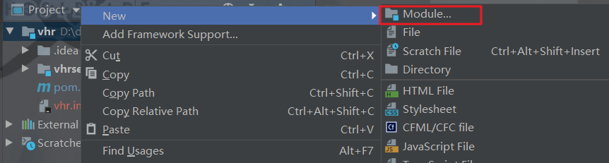
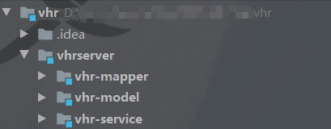

# 一、多模块项目改造

## 1.1. 修改Maven Jdk版本

Idea 创建的 Maven 工程默认的JDK版本为 1.5，需要将其转换成 1.8 版本。

找到项目的 Maven 的配置文件：

* 如果使用的是 idea 自带的，路径为 `idea 安装路径/plugins/maven/lib/maven3/conf/setting.xml` （如果使用的是maven2，就找maven2的配置文件）
* 如果是使用自己另下载 Maven，则找自己定义的 Maven 配置文件

修改前

```xml
<profiles>
  <!-- 
    <profile>
      <id>jdk-1.4</id>

      <activation>
        <jdk>1.4</jdk>
      </activation>

      <repositories>
        <repository>
          <id>jdk14</id>
          <name>Repository for JDK 1.4 builds</name>
          <url>http://www.myhost.com/maven/jdk14</url>
          <layout>default</layout>
          <snapshotPolicy>always</snapshotPolicy>
        </repository>
      </repositories>
    </profile>
    -->
</profiles>
```

修改后

```xml
<profiles>
  <profile>
    <id>jdk-1.8</id>

    <activation>
      <jdk>1.8</jdk>
    </activation>

    <properties>
      <maven.compiler.source>1.8</maven.compiler.source>
      <maven.compiler.target>1.8</maven.compiler.target>
      <maven.compiler.compilerVersion>1.8</maven.compiler.compilerVersion>
    </properties>

    <!--<repositories>
        <repository>
          <id>jdk14</id>
          <name>Repository for JDK 1.4 builds</name>
          <url>http://www.myhost.com/maven/jdk14</url>
          <layout>default</layout>
          <snapshotPolicy>always</snapshotPolicy>
        </repository>
      </repositories>-->
  </profile>
</profiles>
```

## 1.2. 改造多模块项目

1、Springboot 项目主要文件： `src`、`pom.xml` ，所以删除项目 `vhr` 除 `src、pom.xml` 之外的文件

2、删除后修改 `pom.xml` 的部分信息如下所示；之后将项目文件名 `vhr` 修改成 `vhr-web`

```xml
<groupId>org.javaboy</groupId>
<artifactId>vhr-web</artifactId>
<version>0.0.1-SNAPSHOT</version>
<name>vhr-web</name>
<!-- 修改前
<groupId>org.javaboy</groupId>
<artifactId>vhr</artifactId>
<version>0.0.1-SNAPSHOT</version>
<name>vhr</name>
-->
```

3、新建 Maven 工程，项目名为 `vhr` （注意：原本的 vhr 已被修改成 vhr-web，所以这里使用 vhr 为项目名不会出错）

4、删除 `vhr` 的 src 文件夹，在项目 `vhr` 中右键 新建 Model，新建一个 maven 工程，名为 vhrserver



5、同理在 vhrserver 下创建模块，将项目文件部署成下面样子（都为Maven工程）



6、将 `vhr-web` 项目文件夹移到 vhrserver 文件夹下，和上图四个模块同级；移动之后发现 `vhr-web` 文件相比于其余四个模块图标样式不同，这是因为 `vhr-web` 不是maven工程，解决方法：找到 `vhr-web/pom.xml` 文件，打开后右键选择下图的 `Add as Maven Project` 选项


得到项目


7、将 `vur-web/pom.xml` 中的下面内容剪切后放到 `vue/pom.xml` 中（注意放的位置）

```xml
<parent>
  <groupId>org.springframework.boot</groupId>
  <artifactId>spring-boot-starter-parent</artifactId>
  <version>2.2.5.RELEASE</version>
  <relativePath/> <!-- lookup parent from repository -->
</parent>
```

然后给原本的 `vur-web/pom.xml` 添加下面的 parent

```xml
<parent>
  <artifactId>vhrserver</artifactId>
  <groupId>org.javaboy</groupId>
  <version>1.0-SNAPSHOT</version>
</parent>
```

8、项目模块划分，将 `vhr-web` 模块中的文件进行划分，按下图进行划分


划分完后将项目模块的 pom.xml 修改成下面的样子

vhr：项目

```xml
<!-- pom.xml -->
<?xml version="1.0" encoding="UTF-8"?>
<project xmlns="http://maven.apache.org/POM/4.0.0"
         xmlns:xsi="http://www.w3.org/2001/XMLSchema-instance"
         xsi:schemaLocation="http://maven.apache.org/POM/4.0.0 http://maven.apache.org/xsd/maven-4.0.0.xsd">
  <modelVersion>4.0.0</modelVersion>
  <parent>
    <groupId>org.springframework.boot</groupId>
    <artifactId>spring-boot-starter-parent</artifactId>
    <version>2.2.5.RELEASE</version>
    <relativePath/> 
  </parent>
  <groupId>org.javaboy</groupId>
  <artifactId>vhr</artifactId>
  <packaging>pom</packaging>
  <version>1.0-SNAPSHOT</version>
  <modules>
    <module>vhrserver</module>
  </modules>
</project>
```

* vhrserver：模块集合，让其余小模块关联起来
  
  ```xml
  <!-- pom.xml -->
  <?xml version="1.0" encoding="UTF-8"?>
  <project xmlns="http://maven.apache.org/POM/4.0.0"
           xmlns:xsi="http://www.w3.org/2001/XMLSchema-instance"
           xsi:schemaLocation="http://maven.apache.org/POM/4.0.0 http://maven.apache.org/xsd/maven-4.0.0.xsd">
    <parent>
      <artifactId>vhr</artifactId>
      <groupId>org.javaboy</groupId>
      <version>1.0-SNAPSHOT</version>
    </parent>
    <modelVersion>4.0.0</modelVersion>
  
    <artifactId>vhrserver</artifactId>
    <packaging>pom</packaging>
    <modules>
      <module>vhr-mapper</module>
      <module>vhr-model</module>
      <module>vhr-service</module>
      <module>vhr-web</module>
    </modules>
  </project>
  ```
  
  * vhr-mapper：数据库方面（Mapper层）
  
    ```xml
    <!-- pom.xml -->
    <?xml version="1.0" encoding="UTF-8"?>
    <project xmlns="http://maven.apache.org/POM/4.0.0"
             xmlns:xsi="http://www.w3.org/2001/XMLSchema-instance"
             xsi:schemaLocation="http://maven.apache.org/POM/4.0.0 http://maven.apache.org/xsd/maven-4.0.0.xsd">
      <parent>
        <artifactId>vhrserver</artifactId>
        <groupId>org.javaboy</groupId>
        <version>1.0-SNAPSHOT</version>
      </parent>
      <modelVersion>4.0.0</modelVersion>
    
      <artifactId>vhr-mapper</artifactId>
      <dependencies>
        <!-- 引入vhr-model模块(因为vhr-mapper需要依赖vhr-model)-->
        <dependency>
          <groupId>org.javaboy</groupId>
          <artifactId>vhr-model</artifactId>
          <version>1.0-SNAPSHOT</version>
        </dependency>
        <!-- 数据库 -->
        <dependency>
          <groupId>org.mybatis.spring.boot</groupId>
          <artifactId>mybatis-spring-boot-starter</artifactId>
          <version>2.1.2</version>
        </dependency>
        <!-- 引人数据库的驱动-->
        <dependency>
          <groupId>com.alibaba</groupId>
          <artifactId>druid-spring-boot-starter</artifactId>
          <version>1.1.10</version>
        </dependency>
      </dependencies>
    
      <build>
        <!-- 打包过滤 -->
        <resources>
          <resource>
            <directory>src/main/java</directory>
            <includes>
              <include>**/*.xml</include>
            </includes>
          </resource>
          <resource>
            <directory>src/main/resources</directory>
          </resource>
        </resources>
      </build>
    </project>
    ```
  
     * vhr-model：安全、swagger文档（Model层 (Bean)）
  
       ```xml
       <!-- pom.xml -->
       <?xml version="1.0" encoding="UTF-8"?>
       <project xmlns="http://maven.apache.org/POM/4.0.0"
                xmlns:xsi="http://www.w3.org/2001/XMLSchema-instance"
                xsi:schemaLocation="http://maven.apache.org/POM/4.0.0 http://maven.apache.org/xsd/maven-4.0.0.xsd">
         <parent>
           <artifactId>vhrserver</artifactId>
           <groupId>org.javaboy</groupId>
           <version>1.0-SNAPSHOT</version>
         </parent>
         <modelVersion>4.0.0</modelVersion>
       
         <artifactId>vhr-model</artifactId>
       
         <dependencies>
           <!-- 引入web模块 -->
         <dependency>
             <groupId>org.springframework.boot</groupId>
             <artifactId>spring-boot-starter-web</artifactId>
           </dependency>
           <!-- 安全 -->
           <dependency>
             <groupId>org.springframework.boot</groupId>
             <artifactId>spring-boot-starter-security</artifactId>
           </dependency>
           <!-- swagger2：在线api文档 -->
           <dependency>
             <groupId>io.springfox</groupId>
             <artifactId>springfox-swagger2</artifactId>
             <version>2.9.2</version>
           </dependency>
           <!-- swagger2 UI 界面 -->
           <dependency>
             <groupId>io.springfox</groupId>
             <artifactId>springfox-swagger-ui</artifactId>
             <version>2.9.2</version>
           </dependency>
         </dependencies>
       </project>
       ```
  
  * vhr-service：业务操作方面、excel POI 操作（Service层）
    
    ```xml
    <!-- pom.xml -->
    <?xml version="1.0" encoding="UTF-8"?>
    <project xmlns="http://maven.apache.org/POM/4.0.0"
             xmlns:xsi="http://www.w3.org/2001/XMLSchema-instance"
             xsi:schemaLocation="http://maven.apache.org/POM/4.0.0 http://maven.apache.org/xsd/maven-4.0.0.xsd">
    <parent>
        <artifactId>vhrserver</artifactId>
      <groupId>org.javaboy</groupId>
        <version>1.0-SNAPSHOT</version>
      </parent>
      <modelVersion>4.0.0</modelVersion>
      
      <artifactId>vhr-service</artifactId>
      
      <dependencies>
        <!-- 引入vhr-mapper模块（因为vhr-service是在vhr-mapper层基础上开发的） -->
        <dependency>
          <groupId>org.javaboy</groupId>
          <artifactId>vhr-mapper</artifactId>
          <version>1.0-SNAPSHOT</version>
        </dependency>
        <!-- 操作excel POI -->
        <dependency>
          <groupId>org.apache.poi</groupId>
          <artifactId>poi</artifactId>
          <version>4.1.2</version>
        </dependency>
      </dependencies>
    </project>
    ```
    
  * vhr-web：涉及到网络服务方面（Controller层）
    
    ```xml
    <!-- pom.xml -->
    <?xml version="1.0" encoding="UTF-8"?>
    <project xmlns="http://maven.apache.org/POM/4.0.0" xmlns:xsi="http://www.w3.org/2001/XMLSchema-instance"
             xsi:schemaLocation="http://maven.apache.org/POM/4.0.0 https://maven.apache.org/xsd/maven-4.0.0.xsd">
      <modelVersion>4.0.0</modelVersion>
      
      <parent>
        <artifactId>vhrserver</artifactId>
        <groupId>org.javaboy</groupId>
        <version>1.0-SNAPSHOT</version>
      </parent>
      
      <groupId>org.javaboy</groupId>
      <artifactId>vhr-web</artifactId>
      <version>0.0.1-SNAPSHOT</version>
      <name>vhr-web</name>
      <description>Demo project for Spring Boot</description>
      
      <properties>
        <java.version>1.8</java.version>
      </properties>
      
      <dependencies>
        <!-- 引入vhr-service和其余模块关联 -->
        <dependency>
          <groupId>org.javaboy</groupId>
          <artifactId>vhr-service</artifactId>
          <version>1.0-SNAPSHOT</version>
        </dependency>
        <!-- mysql驱动（唯有运行时才会生效所以需要放在vhr-web中） -->
        <dependency>
          <groupId>mysql</groupId>
          <artifactId >mysql-connector-java</artifactId>
          <version>5.1.6</version>
        </dependency>
        <!-- 引入切面 -->
        <dependency>
          <groupId>org.aspectj</groupId>
          <artifactId>aspectjweaver</artifactId>
          <version>1.9.5</version>
        </dependency>
        <!-- 测试 -->
        <dependency>
          <groupId>org.springframework.boot</groupId>
          <artifactId>spring-boot-starter-test</artifactId>
          <scope>test</scope>
          <exclusions>
            <exclusion>
              <groupId>org.junit.vintage</groupId>
              <artifactId>junit-vintage-engine</artifactId>
            </exclusion>
          </exclusions>
        </dependency>
        <dependency>
          <groupId>org.springframework.security</groupId>
          <artifactId>spring-security-test</artifactId>
          <scope>test</scope>
        </dependency>
    </dependencies>
      
      <build>
        <!-- 防止过滤 -->
        <resources>
          <resource>
            <directory>src/main/resources</directory>
          </resource>
          <resource>
            <directory>src/main/java</directory>
            <includes>
              <include>**/*.xml</include>
            </includes>
          </resource>
        </resources>
      
        <plugins>
          <plugin>
            <groupId>org.springframework.boot</groupId>
            <artifactId>spring-boot-maven-plugin</artifactId>
          </plugin>
        </plugins>
      </build>
    </project>
    ```


# 二、搭建邮件服务

## 2.1. 搭建消息中间件

1、使用 Docker 在服务器上下载 `RabbitMQ`

```shell
docker run -d --hostname my-rabbit --name changingTao-rabbit -p 5672:5672 -p 15672:15672 rabbitmq:3-management
```

2、登录邮箱，点击设置，开启 POP3/SMTP 服务


3、在 vhr 项目下创建模块 Springboot工程，选择下面三个依赖


4、修改 pom.xml 信息

```xml
<!-- mailserver/pom.xml -->
<?xml version="1.0" encoding="UTF-8"?>
<project xmlns="http://maven.apache.org/POM/4.0.0" xmlns:xsi="http://www.w3.org/2001/XMLSchema-instance"
         xsi:schemaLocation="http://maven.apache.org/POM/4.0.0 https://maven.apache.org/xsd/maven-4.0.0.xsd">
  <modelVersion>4.0.0</modelVersion>
  <!-- 修改其父为vhr -->
  <parent>
    <artifactId>vhr</artifactId>
    <groupId>org.javaboy</groupId>
    <version>1.0-SNAPSHOT</version>
  </parent>
  <groupId>org.javaboy</groupId>
  <artifactId>mailserver</artifactId>
  <version>0.0.1-SNAPSHOT</version>
  <name>mailserver</name>
  <description>Demo project for Spring Boot</description>

  <properties>
    <java.version>1.8</java.version>
  </properties>

  <dependencies>
    <!-- 依赖model -->
    <dependency>
      <groupId>org.javaboy</groupId>
      <artifactId>vhr-model</artifactId>
      <version>1.0-SNAPSHOT</version>
    </dependency>
    <!-- rabbitmq -->
    <dependency>
      <groupId>org.springframework.boot</groupId>
      <artifactId>spring-boot-starter-amqp</artifactId>
    </dependency>
    <!-- 发送邮件依赖 -->
    <dependency>
      <groupId>org.springframework.boot</groupId>
      <artifactId>spring-boot-starter-mail</artifactId>
    </dependency>
    <!-- 消息模板 -->
    <dependency>
      <groupId>org.springframework.boot</groupId>
      <artifactId>spring-boot-starter-thymeleaf</artifactId>
    </dependency>

    <dependency>
      <groupId>org.springframework.boot</groupId>
      <artifactId>spring-boot-starter-test</artifactId>
      <scope>test</scope>
      <exclusions>
        <exclusion>
          <groupId>org.junit.vintage</groupId>
          <artifactId>junit-vintage-engine</artifactId>
        </exclusion>
      </exclusions>
    </dependency>
    <dependency>
      <groupId>org.springframework.amqp</groupId>
      <artifactId>spring-rabbit-test</artifactId>
      <scope>test</scope>
    </dependency>
  </dependencies>

  <build>
    <plugins>
      <plugin>
        <groupId>org.springframework.boot</groupId>
        <artifactId>spring-boot-maven-plugin</artifactId>
      </plugin>
    </plugins>
  </build>
</project>
```

```xml
<!-- vhr/pom.xml -->
<?xml version="1.0" encoding="UTF-8"?>
<project xmlns="http://maven.apache.org/POM/4.0.0"
         xmlns:xsi="http://www.w3.org/2001/XMLSchema-instance"
         xsi:schemaLocation="http://maven.apache.org/POM/4.0.0 http://maven.apache.org/xsd/maven-4.0.0.xsd">
  <modelVersion>4.0.0</modelVersion>
  <parent>
    <groupId>org.springframework.boot</groupId>
    <artifactId>spring-boot-starter-parent</artifactId>
    <version>2.2.5.RELEASE</version>
    <relativePath/> <!-- lookup parent from repository -->
  </parent>
  <groupId>org.javaboy</groupId>
  <artifactId>vhr</artifactId>
  <packaging>pom</packaging>
  <version>1.0-SNAPSHOT</version>
  <modules>
    <module>vhrserver</module>
    <!-- 添加子模块 -->
    <module>mailserver</module>
  </modules>
</project>
```

5、模块配置

```properties
# 邮件服务 配置填写参照开启 POP3/SMTP 服务的供应商
server.port=8082
spring.mail.host=smtp.163.com
spring.mail.protocol=smtp
spring.mail.default-encoding=UTF-8
# 注册POP3/SMTP时生成的密码
spring.mail.password=xxxxxx
spring.mail.username=rocketwizt@163.com
spring.mail.port=465
spring.mail.properties.mail.stmp.socketFactory.class=javax.net.ssl.SSLSocketFactory
spring.mail.properties.mail.debug=true

# 消息中间件 
spring.rabbitmq.username=guest
spring.rabbitmq.password=guest
spring.rabbitmq.host=120.xxx.xxx.xxx
spring.rabbitmq.port=5672
```

注意：消息中间件作用：添加员工时，使用消息中间件来发送邮件给入职的员工，所以需要给 Employee.java 进行序列化才行， `implements Serializable`

6、配置消息队列和消息模板

在 mailservice 模块中配置下面内容

```java
@SpringBootApplication
public class MailserverApplication {

  public static void main(String[] args) {
    SpringApplication.run(MailserverApplication.class, args);
  }
  @Bean
  Queue queue(){
    return new Queue("changingTao.mail.welcome");
  }
  
}
```

```java
@Component
public class MailReceiver {

    public static final Logger logger = LoggerFactory.getLogger(MailReceiver.class);

    // 邮件发送
    @Autowired
    JavaMailSender javaMailSender;
    // 获取邮件发送者邮箱名
    @Autowired
    MailProperties mailProperties;
    // 设置模板实体类
    @Autowired
    TemplateEngine templateEngine;

    // 监听 `changingTao.mail.welcome` 消息队列，如果出现新消息则进行下面的操作
    @RabbitListener(queues = "changingTao.mail.welcome")
    public void handler(Employee employee) {
        logger.info(employee.toString());
        // 收到消息，发送邮件
        MimeMessage msg = javaMailSender.createMimeMessage();
        MimeMessageHelper helper = new MimeMessageHelper(msg);
        try {
            helper.setTo(employee.getEmail());
            helper.setFrom(mailProperties.getUsername());
            // 设置邮件标题
            helper.setSubject("入职欢迎");
            // 设置时间
            helper.setSentDate(new Date());

            // 设置模板内容（赋值）
            Context context = new Context();
            context.setVariable("name", employee.getName());
            context.setVariable("posName", employee.getPosition().getName());
            context.setVariable("joblevelName", employee.getJobLevel().getName());
            context.setVariable("departmentName", employee.getDepartment().getName());

            // 模板渲染：主题，内容
            String mail = templateEngine.process("mail", context);
            helper.setText(mail, true);
            // 发送邮件
            javaMailSender.send(msg);
        } catch (MessagingException e) {
            e.printStackTrace();
            logger.error("邮件发送失败，原因：" + e.getMessage());
        }
    }
}
```

```html
<!-- 邮件模板 mail.html -->
<!DOCTYPE html>
<html lang="en" xmlns:th="http://www.thymeleaf.org">
  <head>
    <meta charset="UTF-8">
    <title>入职欢迎邮件</title>
  </head>
  <body>
    欢迎 <span th:text="${name}"></span> 加入 Java达摩院 大家庭，您的入职信息如下：
    <table border="1">
      <tr>
        <td>姓名</td>
        <td th:text="${name}"></td>
      </tr>
      <tr>
        <td>职位</td>
        <td th:text="${posName}"></td>
      </tr>
      <tr>
        <td>职称</td>
        <td th:text="${joblevelName}"></td>
      </tr>
      <tr>
        <td>部门</td>
        <td th:text="${departmentName}"></td>
      </tr>
    </table>

    <p>希望在未来的日子里，携手共进！</p>
  </body>
</html>
```

## 2.2. 业务代码

需求：消息中间件已完成，消息中间件用于在添加员工的时候，给新员工发送邮件信息

1、给发送邮件需要的信息 `Position`、`JobLevel`、`Department`、`Employee` 实体类接入序列化 `implements Serializable` ，如果不设置成序列化则出现报错

2、给 vhr-service 模块添加 `rabbitmq` 依赖，以此发送消息模板

```xml
<dependency>
  <groupId>org.springframework.boot</groupId>
  <artifactId>spring-boot-starter-amqp</artifactId>
</dependency> 
```
3、在添加员工的方法中添加消息模板信息

Service 层

* 注意：在添加员工方法中，Id 是在插入之后才会自动生成主键。虽然已经执行了插入操作，但我们无法直接从 Bean 中获取 Id 内容。所以需要在 Mapper 层的插入方法中添加属性，强制自动生成主键

```java
@Service
public class EmployeeService {
  @Autowired
  EmployeeMapper employeeMapper;
  // 消息模板
  @Autowired
  RabbitTemplate rabbitTemplate;
  // 日志
  public final static Logger logger = LoggerFactory.getLogger(EmployeeService.class);

  public Integer addEmp(Employee employee) {
    // 在添加员工的时候将合同期限计算出来，并存入数据库
    Date beginContract = employee.getBeginContract();
    Date endContract = employee.getEndContract();
    double month = (Double.parseDouble(yearFormat.format(endContract)) - Double.parseDouble(yearFormat.format(beginContract))) * 12
      + (Double.parseDouble(monthFormat.format(endContract)) - Double.parseDouble(monthFormat.format(beginContract)));

    employee.setContractTerm(Double.parseDouble(decimalFormat.format(month/12)));

    int result = employeeMapper.insertSelective(employee);
    // 添加成功后发送邮件信息给员工
    if (result == 1){
      logger.info(employee.toString());
      // 查询刚插入的员工信息返回给消息队列
      Employee emp =  employeeMapper.getEmployeeById(employee.getId());
      rabbitTemplate.convertAndSend("changingTao.mail.welcome", emp);
    }
    return result;
  }
}
```

Mapper 层

* 注意：在插入方法中添加下面两个数据， 强制自动生成主键 

  ```java
  useGeneratedKeys="true" keyProperty="id"
  ```

* 相比于上面的查询，只是添加多了个查询限制：id

```xml
<!-- 添加员工 -->
<insert id="insertSelective" parameterType="org.javaboy.vhr.model.Employee" useGeneratedKeys="true" keyProperty="id">
  insert into employee
  <trim prefix="(" suffix=")" suffixOverrides=",">
    <if test="id != null">
      id,
    </if>
  </trim>
  <trim prefix="values (" suffix=")" suffixOverrides=",">
    <if test="id != null">
      #{id,jdbcType=INTEGER},
    </if>
  </trim>
</insert>
<!-- 根据ID搜索员工 -->
<select id="getEmployeeById" resultMap="AllEmployeeInfo">
  select e.*,p.`id` as pid,p.`name` as pname,n.`id` as nid,n.`name` as nname,d.`id` as did,d.`name` as
  dname,j.`id` as jid,j.`name` as jname,pos.`id` as posid,pos.`name` as posname from employee e,nation
  n,politicsstatus p,department d,joblevel j,position pos where e.`nationId`=n.`id` and e.`politicId`=p.`id` and
  e.`departmentId`=d.`id` and e.`jobLevelId`=j.`id` and e.`posId`=pos.`id` and e.`id` = #{id}
</select>
```


1、主键是插入后才生成的，但后续操作需要用到此主键，怎么修改才能让数据插入完成后自动将主键填入原本的类？

在插入xml文件语句中添加以下属性 强制自动生成主键 

```xml
useGeneratedKeys="true" keyProperty="id"
```

得到：

```xml
<insert id="insertSelective" parameterType="org.javaboy.vhr.model.Employee" useGeneratedKeys="true" keyProperty="id">
  insert into employee
  <trim prefix="(" suffix=")" suffixOverrides=",">
    <if test="id != null">
      id,
    </if>
  </trim>
  <trim prefix="values (" suffix=")" suffixOverrides=",">
    <if test="id != null">
      #{id,jdbcType=INTEGER},
    </if>
  </trim>
</insert>
```

这样在插入之后使用 get 获取 Id 就不会出现获取为空的情况


