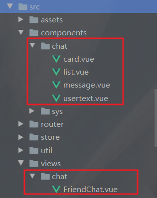
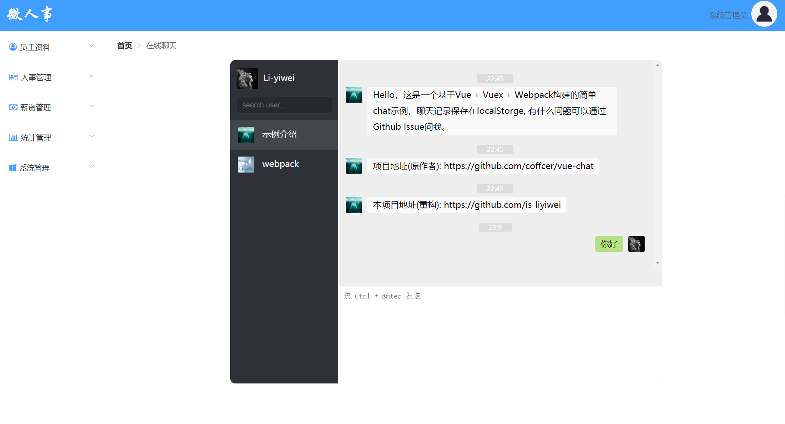
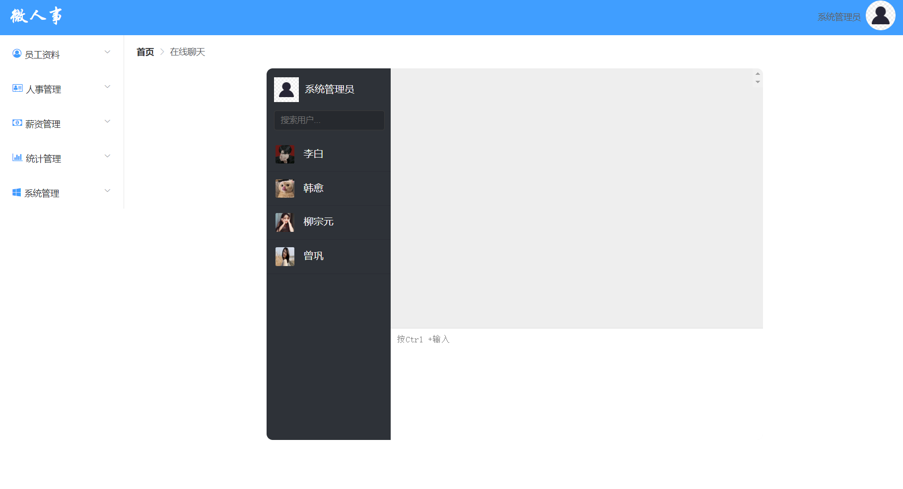
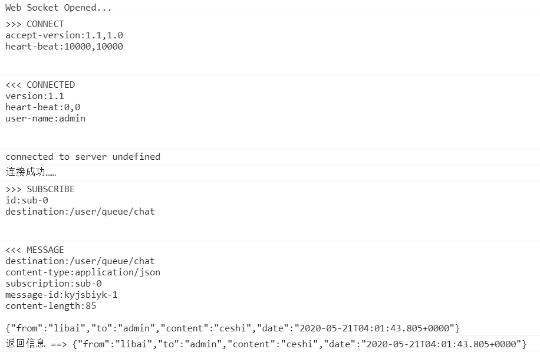

# 一、在线聊天功能 开发

## 1.1. 在线聊天功能界面绘制

在线聊天功能的界面使用第三方的项目：

* https://github.com/Coffcer/vue-chat （vue 1.x）官方版本
*  https://github.com/is-liyiwei/vue-Chat-demo （vue 2.x）有人在此基础上进行了vue升级

这里使用 vue2.x 版的界面

下载项目

```shell
git clone https://github.com/is-liyiwei/vue-Chat-demo.git
```

将第三方项目引入 微人事 步骤：

1、新建如下图的文件夹，将在线聊天项目中 app.vue 内容copy到 `@/views/chat/FriendChat.vue` 组件中，然后再从里面找到它的四个依赖组件，放到 下图 `@/components/chat` 下。

注意：需要修改 FriendChat.vue 组件中的引入路径，确保正确引入在线聊天项目子组件



2、下载依赖

```shell
npm install sass-loader --save-dev
npm install node-sass --save-dev
```

3、修改本地路由配置，将在线聊天组件添加到 home 组件中

```js
import Vue from 'vue'
import VueRouter from 'vue-router'

Vue.use(VueRouter)

const Login = () => import ('@/views/Login')
const Home = () => import ('@/views/Home')
// 在线聊天组件
const FriendChat = () => import('@/views/chat/FriendChat')

const routes = [
  {path: '/', name: 'Login', component: Login, hidden: true},
  {path: '/home', name: 'Home', component: Home, hidden: true},
  {
    path: '/home',
    name: '导航栏',
    component: Home,
    children: [{path: '/chat', name: '在线聊天', component: FriendChat, hidden: true},]
  },
]

const router = new VueRouter({
  routes,
})

export default router
```

3、修改本地的 Vuex 配置，修改前：

```js
import Vue from 'vue'
import Vuex from 'vuex'

Vue.use(Vuex)

export default new Vuex.Store({
  state: {
    routes: []
  },
  mutations: {
    initRoutes(state, data) {
      state.routes = data;
    }
  },
  actions: {}
})
```

修改后：

```js
import Vue from 'vue'
import Vuex from 'vuex'

Vue.use(Vuex)

const now = new Date();

const store = new Vuex.Store({
  state: {
    routes: [],
    sessions: [{
      id: 1,
      user: {
        name: '示例介绍',
        img: 'https://ss1.bdstatic.com/70cFuXSh_Q1YnxGkpoWK1HF6hhy/it/u=3437217665,1564280326&fm=26&gp=0.jpg'
      },
      messages: [{
        content: 'Hello，这是一个基于Vue + Vuex + Webpack构建的简单chat示例，聊天记录保存在localStorge, 有什么问题可以通过Github Issue问我。',
        date: now
      }, {
        content: '项目地址(原作者): https://github.com/coffcer/vue-chat',
        date: now
      }, {
        content: '本项目地址(重构): https://github.com/is-liyiwei',
        date: now
      }]
    }, {
      id: 2,
      user: {
        name: 'webpack',
        img: 'https://timgsa.baidu.com/timg?image&quality=80&size=b9999_10000&sec=1589907682498&di=602a83fd6ecfa14fd4f1138cbd63b026&imgtype=0&src=http%3A%2F%2Ffile02.16sucai.com%2Fd%2Ffile%2F2014%2F1006%2Fe94e4f70870be76a018dff428306c5a3.jpg'
      },
      messages: [{
        content: 'Hi，我是webpack哦',
        date: now
      }]
    }],
    currentSession: 1,
    filterKey: ''
  },
  mutations: {
    initRoutes(state, data) {
      state.routes = data;
    },
    changeCurrentSession(state, id) {
      state.currentSession = id;
    },
    addMessage(state, msg) {
      state.sessions[state.currentSession - 1].messages.push({
        content: msg,
        date: new Date(),
        self: true
      })
    },
    INIT_DATA(state) {
      let data = localStorage.getItem('vue-chat-session');
      //console.log(data)
      if (data) {
        state.sessions = JSON.parse(data);
      }
    }
  },
  actions: {
    initData(context) {
      context.commit('INIT_DATA')
    }
  }
})

store.watch(function (state) {
  return state.sessions
}, function (val) {
  console.log('CHANGE: ', val);
  localStorage.setItem('vue-chat-session', JSON.stringify(val));
}, {
  deep: true/*这个貌似是开启watch监测的判断,官方说明也比较模糊*/
})

export default store;
```

开启项目访问得到下图	



## 1.2. 前后端 - 获取用户列表

后端：

获取除自己之外的用户信息

Controller层

```java
@RestController
@RequestMapping("/chat")
public class ChatController {

  @Autowired
  HrService hrService;
  @GetMapping("/hrs")
  public List<Hr> getAllHrs(){
   	return hrService.getAllHrsExceptCurrentHr();
  }
}
```

Service 层

```java
@Service
public class HrService implements UserDetailsService {

  @Autowired
  HrMapper hrMapper;
  public List<Hr> getAllHrsExceptCurrentHr() {
    return hrMapper.getAllHrsExceptCurrentHr(HrUtils.getCurrentHr().getId());
  }
}
```

Mapper 层

```xml
<select id="getAllHrsExceptCurrentHr" resultMap="BaseResultMap">
  select * from hr where id != #{id}
</select>
```

---

前端：

修改 vuex ，加载用户列表到 list 组件中

```js
import Vue from 'vue'
import Vuex from 'vuex'
import {getRequest} from "../util/api";

Vue.use(Vuex)

const now = new Date();

const store = new Vuex.Store({
  state: {
    routes: [],
    sessions: [],
    currentSession: -1,
    filterKey: '',
    hrs: []
  },
  mutations: {
    initRoutes(state, data) {
      state.routes = data;
    },
    changeCurrentSession(state, id) {
      state.currentSession = id;
    },
    addMessage(state, msg) {
      state.sessions[state.currentSession - 1].messages.push({
        content: msg,
        date: new Date(),
        self: true
      })
    },
    INIT_DATA(state) {
      // TODO 浏览器本地的历史聊天记录可以在这里完成
      // let data = localStorage.getItem('vue-chat-session');
      // //console.log(data)
      // if (data) {
      //     state.sessions = JSON.parse(data);
      // }
    },
    INIT_HR(state, data) {
      state.hrs = data
    }
  },
  actions: {
    initData(context) {
      context.commit('INIT_DATA')
      getRequest("/chat/hrs").then(res => {
        if (res) {
          console.log(res);
          context.commit('INIT_HR', res)
        }
      })
    }
  }
})

store.watch(function (state) {
  return state.sessions
}, function (val) {
  console.log('CHANGE: ', val);
  localStorage.setItem('vue-chat-session', JSON.stringify(val));
}, {
  deep: true/*这个貌似是开启watch监测的判断,官方说明也比较模糊*/
})

export default store;
```

list 组件

```vue
<template>
<div id="list">
  <ul>
    <li v-for="item in hrs" :class="{ active: item.id === currentSession }" v-on:click="changeCurrentSession(item.id)"><!--   :class="[item.id === currentSession ? 'active':'']" -->
      
      <p class="name">{{item.name}}</p>
  </li>
  </ul>
  </div>
</template>

<script>
  import {mapState} from 'vuex'

  export default {
    name: 'list',
    data () {
      return {

      }
    },
    computed: mapState([
      'hrs',
      'currentSession'
    ]),
    methods:{
      changeCurrentSession:function (id) {
        this.$store.commit('changeCurrentSession',id)
      }
    }
  }
</script>
```

card 组件

```vue
<template>
<div id="card">
  <header>
    
    <p class="name">{{user.name}}</p>
  </header>
  <footer>
    <input class="search" type="text" v-model="$store.state.filterKey" placeholder="search user...">
  </footer>
  </div>
</template>

<script>
  export default {
    name: 'card',
    data () {
      return {
        // 登录的时候存储了用户的session
        user: JSON.parse(window.sessionStorage.getItem("user"))
      }
    }
  }
</script>
```

实现效果：



## 1.3. 后端 - 引入 websocket 开发

给 vhr-web 中引入依赖

```xml
<!-- websocket在线聊天功能 -->
<dependency>
  <groupId>org.springframework.boot</groupId>
  <artifactId>spring-boot-starter-websocket</artifactId>
</dependency>
```

配置 WebSocket

```java
@Configuration // 指明配置类
@EnableWebSocketMessageBroker  // 开启消息代理
public class WebSocketConfig implements WebSocketMessageBrokerConfigurer {
  // 注册端点，前端跟服务端连接的点
  @Override
  public void registerStompEndpoints(StompEndpointRegistry registry) {
    // 允许使用socketJs方式访问，访问点为/ws/ep，允许跨域 在网页上我们就可以通过这个链接 http://localhost:8080/ws/ep 来和服务器的WebSocket连接
    // 设置允许跨域 setAllowedOrigins
    registry.addEndpoint("/ws/ep").setAllowedOrigins("*").withSockJS();
  }
  // 消息代理
  @Override
  public void configureMessageBroker(MessageBrokerRegistry registry) {
    // 配置前端订阅代理
    registry.enableSimpleBroker("/queue");
  }
}
```

创建消息对象

```java
public class ChatMsg {
  private String from;
  private String to;
  private String content;
  private Date data;
  
  // 省略 get/set操作
}
```

Controller 层

```java
@Controller
public class WsController {
  @Autowired
  SimpMessagingTemplate simpMessagingTemplate;

  /** 接收前端发送过来的数据，链接：/ws/chat
     * @param principal 获取当前用户对象
     * @param chatMsg 消息Bean
     */
  @MessageMapping("/ws/chat")
  public void handleMsg(Principal principal, ChatMsg chatMsg){
    chatMsg.setFrom(principal.getName());
    chatMsg.setData(new Date());
    //  simpMessagingTemplate.convertAndSendToUser： 将消息发送给谁？、前端队列监听、发送的消息对象
    // 这里前端队列默认需要在前面添加 /user，所以完整队列为 /user/queue/chat
    simpMessagingTemplate.convertAndSendToUser(chatMsg.getTo(), "/queue/chat", chatMsg);
  }
}
```

## 1.4. 前端连接

这里使用 Stomp 来发送消息、sockJs 来连接服务器，所以需要下载下面两个依赖

```shell
npm install sockjs-client
npm install stompjs
```

修改 VueX 

* 连接服务端以及给队列发送信息

```js
import Vue from 'vue'
import Vuex from 'vuex'
import {getRequest} from "../util/api";
/** 新添加内容 start **/
import SockJS from 'sockjs-client';
import Stomp from 'stompjs';
/** 新添加内容 end **/


Vue.use(Vuex)

const now = new Date();

const store = new Vuex.Store({
  state: {
    routes: [],
    sessions: [],
    currentSession: -1,
    filterKey: '',
    hrs: [],
    stomp: null
  },
  mutations: {
    initRoutes(state, data) {
      state.routes = data;
    },
    changeCurrentSession(state, id) {
      state.currentSession = id;
    },
    addMessage(state, msg) {
      state.sessions[state.currentSession - 1].messages.push({
        content: msg,
        date: new Date(),
        self: true
      })
    },
    INIT_DATA(state) {
      // TODO 浏览器本地的历史聊天记录可以在这里完成
    },
    INIT_HR(state, data) {
      state.hrs = data
    }
  },
  actions: {
    /** 新添加内容 start **/
    connect(context) {
      // 连接服务端操作
      context.state.stomp = Stomp.over(new SockJS("/ws/ep"));
      console.log("连接中……");
      // 连接成功后的操作
      context.state.stomp.connect({}, success => {
        console.log("连接成功……");
        // 订阅服务端的消息，以/user/queue/chat作为队列，给服务器发信息，服务器会监听此队列接收信息
        context.state.stomp.subscribe("/user/queue/chat", msg => {
          console.log("返回信息 ==> " + msg.body);
        })
      }, error => {
        console.log("连接失败……");
      })
    },
    /** 新添加内容 end **/
    initData(context) {
      context.commit('INIT_DATA')
      getRequest("/chat/hrs").then(res => {
        if (res) {
          context.commit('INIT_HR', res)
        }
      })
    }
  }
})

store.watch(function (state) {
  return state.sessions
}, function (val) {
  console.log('CHANGE: ', val);
  localStorage.setItem('vue-chat-session', JSON.stringify(val));
}, {
  deep: true/*这个貌似是开启watch监测的判断,官方说明也比较模糊*/
})
export default store;
```

在全局守卫判断用户是否登录的 initMenu 方法中引用 actions 中的 connect 方法，连接 websocket

```js
// menus.js
export const initMenu = (router, store) => {
  if (store.state.routes.length > 0) {
    return;
  }
  getRequest("/system/config/menu").then(data => {
    if (data) {
      // 格式化返 回数据
      let fmtRoutes = formatRoutes(data);
      // 将格式化后的数据存放到路由配置中
      router.addRoutes(fmtRoutes);
      // 将数据存放到VueX中
      store.commit('initRoutes', fmtRoutes)
      // 连接服务端websocket
      store.dispatch('connect');
    }
  })
}
```

修改 usertext 组件，在用户点击发送消息的时候将消息

```vue
<template>
<div id="uesrtext">
  <textarea placeholder="按 Ctrl + Enter 发送" v-model="content" v-on:keyup="addMessage"></textarea>
  </div>
</template>

<script>
  import {mapState} from 'vuex'

  export default {
    name: 'uesrtext',
    data() {
      return {
        content: ''
      }
    },
    methods: { 	
      addMessage(e) {
        if (e.ctrlKey && e.keyCode === 13 && this.content.length) {
          /** 修改的地方 start **/
          // 创建一个对象，从里面放 接收方、消息的内容
          let msgObj = new Object();
          msgObj.to = 'admin';
          msgObj.content = this.content
          // 通过 stomp.send 来发送信息给服务器，参数：消息地址，消息优先级，消息的内容
          this.$store.state.stomp.send("/ws/chat", {}, JSON.stringify(msgObj));
          /** 修改的地方 end **/
        }
      }
    }
  }
</script>
```

修改 vue.config.js 进行路径映射

```js
let proxyObj = {};

/** 添加的地方 start **/
proxyObj['/ws']={
  ws: true, // 是否代理websockets
  target: 'ws://localhost:8081',
};
/** 添加的地方 end **/
module.exports={
  devServer:{
    host: 'localhost',
    port: 8080,
    proxy: proxyObj
  }
}
```

前后端运行后使用两个浏览器来登录，一个登录 admin、一个登录 libai，之后用 libai 给admin 发送消息后，得到下面信息



## 1.5. 优化用户列表

因为我们直接使用用户名来判断信息，而不是用 Id，所以需要修改 `currentSessionId` 为 `currentSession` ，修改所有判断条件或属性

ctrl + shift + r 全局替换 `currentSessionId` 为 `currentSession`

`list.vue`

```vue
<template>
<div id="list">
  <ul>
    <!-- 修改此行代码 -->
    <li v-for="item in hrs" :class="{ active: currentSession? item.username === currentSession.username : false }" v-on:click="changeCurrentSession(item)">
      
      <p class="name">{{item.name}}</p>
  </li>
  </ul>
  </div>
</template>

<script>
  import {mapState} from 'vuex'

  export default {
    name: 'list',
    data () {
      return {

      }
    },
    computed: mapState([
      'hrs',
      'currentSession'
    ]),
    methods:{
      // 修改方法内容
      changeCurrentSession (currentSession) {
        this.$store.commit('changeCurrentSession',currentSession)
      }
    }
  }
</script>
```

## 1.6. 消息发送处理

将消息按 `当前用户#接受用户` 的格式存储在 VueX 的 session 中

`usertext.vue` 

* ctrl + enter 发送消息时添加事件给 VueX 推送内容

```vue
<template>
<div id="uesrtext">
  <textarea placeholder="按 Ctrl + Enter 发送" v-model="content" v-on:keyup="addMessage"></textarea>
  </div>
</template>

<script>
  import {mapState} from 'vuex'

  export default {
    name: 'uesrtext',
    data() {
      return {
        content: ''
      }
    },
    methods: {
      addMessage(e) {
        if (e.ctrlKey && e.keyCode === 13 && this.content.length) {
          // 创建一个对象，从里面放 接收方、消息的内容
          let msgObj = new Object();
          msgObj.to = 'admin';
          msgObj.content = this.content
          // 通过 stomp.send 来发送信息给服务器，参数：消息地址，消息优先级，消息的内容
          this.$store.state.stomp.send("/ws/chat", {}, JSON.stringify(msgObj));
          /** 修改的地方 start **/
          //  将发送信息的对象提交到vuex中
          this.$store.commit('addMessage', msgObj);
          this.content = '';
          /** 修改的地方 end **/
        }
      }
    }
  }
</script>
```

VueX

* 获取发送的消息对象，将其进行封装并存储到 session 中

```js
import Vue from 'vue'
import Vuex from 'vuex'
import {getRequest} from "../util/api";
import SockJS from 'sockjs-client';
import Stomp from 'stompjs';

Vue.use(Vuex)

const now = new Date();

const store = new Vuex.Store({
  state: {
    routes: [],
    sessions: {}, // 发送信息集（缓存）
    currentSession: null, // 发送信息的对象（聊天列表中被点击的用户）
    currentHr: JSON.parse(window.sessionStorage.getItem("user")), // 当前用户对象
    filterKey: '',
    hrs: [], // 用户列表
    stomp: null // 连接对象
  },
  mutations: {
    /** 修改操作 start **/
    // 点击发送消息之后触发的事件
    addMessage(state, msg) {
      // 在 state.sessions 中创建聊天对象记录数组（如果聊天对象记录数组存在则为引用）
      let mss = state.sessions[state.currentHr.username +'#'+msg.to];
      // 如果聊天记录为空则进行初始化
      if (!mss){
        state.sessions[state.currentHr.username +'#'+msg.to] = []

      }
      // 将发送的消息对象存储到对应数组的session中
      state.sessions[state.currentHr.username +'#'+msg.to].push({
        content: msg.content,
        date: new Date(),
        self: !msg.notSelf // 用作标识是否为自己发送的内容
      })
    },
    /** 修改操作 end **/
    INIT_DATA(state) {
      // TODO 浏览器本地的历史聊天记录可以在这里完成
    },
    INIT_HR(state, data) {
      state.hrs = data
    }
  },
})
export default store;
```

## 1.7. 消息接收处理

编辑 action 中 connect方法中获取到服务端返回过来的消息的函数

* 因为要将服务端发送过来的内容反发送回发送方（确保两边都有数据），所以需要修改以下内容
  * 修改接收到的信息，将发送者 from 改为接收者 to
  * 将 notSelf 设置为 true 证明是不是当前角色发送的内容

```js
actions: {
  connect(context) {
    // 连接服务端操作
    context.state.stomp = Stomp.over(new SockJS("/ws/ep"));
    console.log("连接中……");
    // 连接成功后的操作
    context.state.stomp.connect({}, success => {
      console.log("连接成功……");
      // 订阅服务端的消息，以/user/queue/chat作为队列，给服务器发信息，服务器会监听此队列接收信息
      context.state.stomp.subscribe("/user/queue/chat", msg => {
        // 获取服务端发送的消息 msg（发送消息时提交的对象为接收到服务端信息的对象）
        console.log("获取服务端发送过来的信息", msg);
        let receiveMsg = JSON.parse(msg.body)
        receiveMsg.notSelf = true // 确定不是当前角色发送的内容
        receiveMsg.to = receiveMsg.from // 修改发送的对象
        context.commit('addMessage', receiveMsg) // 发送消息，让两边都存在数据
      })
    }, error => {
      console.log("连接失败……");
    })
  }
}
```

## 1.8. 修改展示页面

因为前面我们修改了 VueX 中 session 的内容，所以之前使用的 message 组件无法正常加载出我们发送的消息，这里修改下获取session中信息的方式

```vue
<template>
<div id="message" v-scroll-bottom="sessions">
  <ul v-if="currentSession">
    <li v-for="entry in sessions[user.username +'#' +currentSession.username]">
      <p class="time">
        <span>{{entry.date | time}}</span>
  </p>
      <div class="main" :class="{self:entry.self}">
        
        <p class="text">{{entry.content}}</p>
  </div>
  </li>
  </ul>
  </div>
</template>
```

顺便修改下提交信息的对象为 list 中选中的对象

```vue
<template>
<div id="uesrtext">
  <textarea placeholder="按 Ctrl + Enter 发送" v-model="content" v-on:keyup="addMessage"></textarea>
  </div>
</template>

<script>
  import {mapState} from 'vuex'

  export default {
    name: 'uesrtext',
    data() {
      return {
        content: ''
      }
    },
    // 引入 vuex
    computed: mapState([
      'hrs',
      'currentSession'
    ]),
    methods: {
      addMessage(e) {
        if (e.ctrlKey && e.keyCode === 13 && this.content.length) {
          let msgObj = new Object();
          // 发送的对象为当前选中的对象
          msgObj.to = this.currentSession.username;
          msgObj.content = this.content
          this.$store.state.stomp.send("/ws/chat", {}, JSON.stringify(msgObj));
          this.$store.commit('addMessage', msgObj);
          this.content = '';
        }
      }
    }
  }
</script>
```

## 1.9 聊天响应式刷新

每次发送信息时不会自动更新消息

为啥发送消息不会自动更新？不是说是响应式嘛？

* 只有Vue本身自己定义过的属性才能进行响应式

既然我们知道是啥原因那按照这个思路解决即可

* 使用 Vue.set() 来设置属性，这样就会被Vue检测到，能进行响应式了
*  `Vue.set( 给哪个对象加属性，属性名，属性值 )`


具体在 VueX 中配置

```js
addMessage(state, msg) {
  // 在 state.sessions 中创建聊天对象记录数组（如果聊天对象记录数组存在则为引用）
  let mss = state.sessions[state.currentHr.username +'#'+msg.to];
  // 如果聊天记录为空则进行初始化
  if (!mss){
    // 将 state.sessions[state.currentHr.username +'#'+msg.to] = [] 通过 Vue.set() 设置为属性
    Vue.set(state.sessions, state.currentHr.username +'#'+msg.to, [])
  }
  // 将发送的消息对象存储到对应数组的session中
  state.sessions[state.currentHr.username +'#'+msg.to].push({
    content: msg.content,
    date: new Date(),
    self: !msg.notSelf // 用作标识是否为自己发送的内容
  })
},
```

## 1.10. 聊天完善

控制当前用户信息获取时机为登录时获取，而不是直接获取浏览器 session 中的 user

* 删除 state 中 currentHr 原本的初始化方式 => 改为登陆成功之后提交信息到VueX并保存

存储聊天内容

* 在监听session值发生变化的时候将内容存储到浏览器session中

```js
Vue.use(Vuex)
const now = new Date();
const store = new Vuex.Store({
  state: {
    routes: [],
    sessions: {},
    currentSession: null, // 发送信息的对象（聊天列表中被点击的用户）
    currentHr: null, // 当前用户对象
    filterKey: '',
    hrs: [], // 用户列表
    stomp: null // 连接对象
  },
  mutations: {
    // 登录的时候将用户信息进行提交赋值
    INIT_CURRENTHR(state, hr){
      state.currentHr = hr
    },
    // 存储聊天内容，将聊天信息存储到 localStorage 中，长期保存
    INIT_DATA(state) {
      let data = localStorage.getItem('vue-chat-session');
      if (data) {
        state.sessions = JSON.parse(data);
      }
    },
    INIT_HR(state, data) {
      state.hrs = data
    }
  },
})
export default store;
```

## 1.11. 消息提示

首先我们有两种消息需要提示：

* element 的 Notification 通知 

  * 主要用在当前用户没有选中这个角色，但是此角色对用户发送了信息，需要进行一个消息通知

  * 在哪里处理？

    * 服务端返回信息回调时处理
    * 判断当前用户聊天列表中选择的对象是不是此信息的发送者，如果是则进行提示，不是则不进行

    ```js
    connect(context) {
      context.state.stomp = Stomp.over(new SockJS("/ws/ep"));
      context.state.stomp.connect({}, success => {
        context.state.stomp.subscribe("/user/queue/chat", msg => {
          let receiveMsg = JSON.parse(msg.body)
          // 如果当前选中的用户不是消息的发送方时,发送通知
          if (!context.state.currentSession || receiveMsg.from != context.state.currentSession.username) {
            Notification.info({
              title: '【' + receiveMsg.fromNickName + '】发来一条消息',
              message: receiveMsg.content.length > 10 ? receiveMsg.content.substr(0, 10) : receiveMsg.content,
              position: 'bottom-right'
            });
          }
          receiveMsg.notSelf = true 
          receiveMsg.to = receiveMsg.from 
          context.commit('addMessage', receiveMsg) 
        })
      }, error => {
        console.log(error);
      })
    }
    ```

* element 的 Badge 标记

  * 消息通知过后如果用户没有及时点击此角色则在用户列表上添加标记

  * 在哪里处理？

    * 首先给用户列表中每个用户一个标记样式 `<el-badge>`

      ```vue
      <!-- list.vue -->
      <template>
      <div id="list">
        <ul>
          <li v-for="item in hrs"
              :class="{ active: currentSession? item.username === currentSession.username : false }"
              v-on:click="changeCurrentSession(item)">
            
            <!-- 标记 -->
            <el-badge :is-dot><p class="name">{{item.name}}</p></el-badge>
        </li>
        </ul>
        </div>
      </template>
      
      <style lang="scss" scoped>
        #list {
          li {
            padding: 16px 15px;
            border-bottom: 1px solid #292C33;
            cursor: pointer;
      
            &:hover {
              background-color: rgba(255, 255, 255, 0.03);
            }
          }
      
          li.active { /*注意这个是.不是冒号:*/
            background-color: rgba(255, 255, 255, 0.1);
          }
      
          .avatar {
            border-radius: 2px;
            width: 30px;
            height: 30px;
            vertical-align: middle;
          }
      
          .name {
            display: inline-block;
            margin-left: 15px;
            margin-top: 0;
            margin-bottom: 0;
          }
        }
      </style>
      ```

    * 在VueX中设置一个属性 isDot 来判断当前用户下的聊天列表角色是否需要添加标记 `badge` ；在服务器返回信息中使用 `Vue.set()` 来设置属性，以服务器返回信息的发送方和接收方为对象，设置值为 true；在VueX的点击用户列表切换聊天角色的方法中，将 isDot 设置为 false

      ```js
      // index.js
      const store = new Vuex.Store({
        state: {
          routes: [],
          sessions: {},
          currentSession: null, // 发送信息的对象（聊天列表中被点击的用户）
          currentHr: null, // 当前用户对象
          filterKey: '',
          hrs: [], // 用户列表
          stomp: null, // 连接对象
          isDot: {} // 用户列表标点 key:用户 value:是否拥有红点
        },
        mutations: {
          changeCurrentSession(state, currentSession) {
            // 点击当前角色，将当前角色的 badge 消除
            Vue.set(state.isDot, state.currentHr.username+'#'+currentSession.username, false)
            state.currentSession = currentSession;
          },
        },
        actions: {
          connect(context) {
            // 连接服务端操作
            context.state.stomp = Stomp.over(new SockJS("/ws/ep"));
            context.state.stomp.connect({}, success => {
              context.state.stomp.subscribe("/user/queue/chat", msg => {
                let receiveMsg = JSON.parse(msg.body)
                // 如果当前选中的用户不是消息的发送方
                if (!context.state.currentSession || receiveMsg.from != context.state.currentSession.username) {
                  Notification.info({
                    title: '【' + receiveMsg.fromNickName + '】发来一条消息',
                    message: receiveMsg.content.length > 10 ? receiveMsg.content.substr(0, 10) : receiveMsg.content,
                    position: 'bottom-right'
                  });
                  // 添加属性：标记红点
                  Vue.set(context.state.isDot, context.state.currentHr.username+'#'+receiveMsg.from, true)
                }
                receiveMsg.notSelf = true 
                receiveMsg.to = receiveMsg.from
                context.commit('addMessage', receiveMsg) 
              })
            }, error => {
              console.log(error);
            })
          },
        }
      })
      ```

      ```vue
      <!-- list.vue -->
      <template>
      <div id="list">
        <ul>
          <li v-for="item in hrs"
              :class="{ active: currentSession? item.username === currentSession.username : false }"
              v-on:click="changeCurrentSession(item)"><!--   :class="[item.id === currentSession ? 'active':'']" -->
            
            <!-- 动态获取 isDot的值，true则标红否则则不标红 -->
            <el-badge :is-dot="isDot[currentHr.username +'#'+item.username]"><p class="name">{{item.name}}</p></el-badge>
        </li>
        </ul>
        </div>
      </template>
      
      <script>
        import {mapState} from 'vuex'
      
        export default {
          name: 'list',
          computed: mapState([
            'hrs',
            'isDot',
            'currentHr',
            'currentSession'
          ]),
        }
      </script>
      ```

      


---

index.js 全部代码(VueX)：

```js
import Vue from 'vue'
import Vuex from 'vuex'
import {getRequest} from "../util/api";
import SockJS from 'sockjs-client';
import Stomp from 'stompjs';
import {Notification} from 'element-ui';

Vue.use(Vuex)

const now = new Date();

const store = new Vuex.Store({
  state: {
    routes: [],
    sessions: {},
    currentSession: null, // 发送信息的对象（聊天列表中被点击的用户）
    currentHr: null, // 当前用户对象
    filterKey: '',
    hrs: [], // 用户列表
    stomp: null, // 连接对象
    isDot: {} // 用户列表标点 key:用户 value:是否拥有红点
  },
  mutations: {
    INIT_CURRENTHR(state, hr) {
      state.currentHr = hr
    },
    initRoutes(state, data) {
      state.routes = data;
    },
    changeCurrentSession(state, currentSession) {
      // 设置红点为false（红点消失）
      Vue.set(state.isDot, state.currentHr.username+'#'+currentSession.username, false)
      state.currentSession = currentSession;
    },
    // 点击发送消息之后触发的事件
    addMessage(state, msg) {
      // 在 state.sessions 中创建聊天对象记录数组（如果聊天对象记录数组存在则为引用）
      let mss = state.sessions[state.currentHr.username + '#' + msg.to];
      // 如果聊天记录为空则进行初始化
      if (!mss) {
        // state.sessions[state.currentHr.username +'#'+msg.to] = []
        Vue.set(state.sessions, state.currentHr.username + '#' + msg.to, [])
      }
      // 将发送的消息对象存储到对应数组的session中
      state.sessions[state.currentHr.username + '#' + msg.to].push({
        content: msg.content,
        date: new Date(),
        self: !msg.notSelf // 用作标识是否为自己发送的内容
      })
    },
    // 存储聊天内容
    INIT_DATA(state) {
      // TODO 浏览器本地的历史聊天记录可以在这里完成
      let data = localStorage.getItem('vue-chat-session');
      if (data) {
        state.sessions = JSON.parse(data);
      }
    },
    INIT_HR(state, data) {
      state.hrs = data
    }
  },
  actions: {
    connect(context) {
      // 连接服务端操作
      context.state.stomp = Stomp.over(new SockJS("/ws/ep"));
      console.log('链接中！');
      // 连接成功后的操作
      context.state.stomp.connect({}, success => {
        console.log('链接成功！' + success);
        // 订阅服务端的消息，以/user/queue/chat作为队列，给服务器发信息，服务器会监听此队列接收信息
        context.state.stomp.subscribe("/user/queue/chat", msg => {
          // 获取服务端发送的消息 msg
          let receiveMsg = JSON.parse(msg.body)
          // 如果当前选中的用户不是消息的发送方
          if (!context.state.currentSession || receiveMsg.from != context.state.currentSession.username) {
            Notification.info({
              title: '【' + receiveMsg.fromNickName + '】发来一条消息',
              message: receiveMsg.content.length > 10 ? receiveMsg.content.substr(0, 10) : receiveMsg.content,
              position: 'bottom-right'
            });
            // 标记红点
            Vue.set(context.state.isDot, context.state.currentHr.username+'#'+receiveMsg.from, true)
          }
          receiveMsg.notSelf = true // 确定是当前角色发送的内容
          receiveMsg.to = receiveMsg.from // 修改发送的对象
          context.commit('addMessage', receiveMsg) // 发送消息
        })
      }, error => {
        console.log('链接失败！');
        console.log(error);
      })
    },
    initData(context) {
      context.commit('INIT_DATA')
      getRequest("/chat/hrs").then(res => {
        if (res) {
          context.commit('INIT_HR', res)
        }
      })
    }
  }
})

// 当 sessions 值发送变化的时候会存储聊天信息
store.watch(function (state) {
  return state.sessions
}, function (val) {
  localStorage.setItem('vue-chat-session', JSON.stringify(val));
}, {
  deep: true/*这个貌似是开启watch监测的判断,官方说明也比较模糊*/
})


export default store;

```


